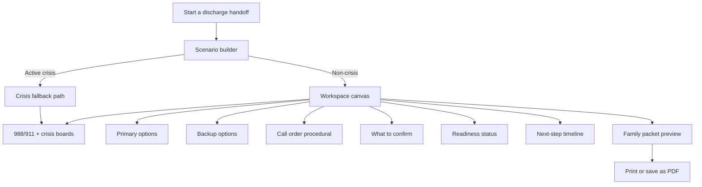
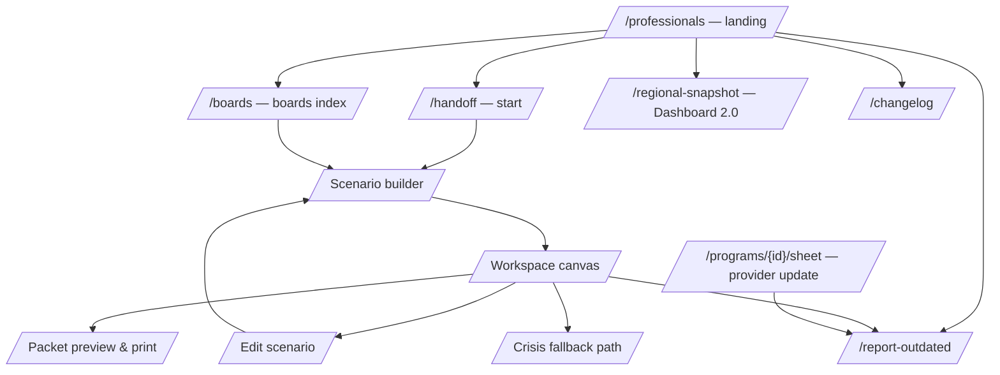
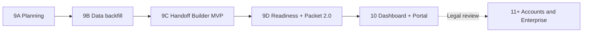

# Phase 9 — Professional Discharge Dashboard Plan

**Document type:** Internal product planning document — not published to viablemhr.com
**Audience:** Product, data, ops, and (where flagged) legal/compliance stakeholders
**Status:** Planning only. No product code changes, no UI edits, no data changes.
**Last updated:** 2026-05-25

**Companion documents:**
- [`docs/product/LAUNCH_SCOPE.md`](LAUNCH_SCOPE.md) — neutrality, no-PHI, no-accounts constraints
- [`docs/research/MARKET_ANALYSIS_2026.md`](../research/MARKET_ANALYSIS_2026.md) — gate framework and feature register
- [`docs/operations/regional-gap/REGIONAL_GAP_2026-Q2.md`](../operations/regional-gap/REGIONAL_GAP_2026-Q2.md) — current data gaps
- [`.cursor/plans/professional_navigator_layer_849c0e3e.plan.md`](../../.cursor/plans/professional_navigator_layer_849c0e3e.plan.md) — Phase 8 implementation that this document iterates on

**Disclaimer:** This document is product planning. It is not legal advice, not clinical advice, and not a commitment to ship every feature. Items marked **Legal Review First** must pass written legal/security review before implementation begins.

---

## 1. Executive summary

### Why the current professional layer is not yet premium enough

Phase 8 ([the professional navigator layer](../../.cursor/plans/professional_navigator_layer_849c0e3e.plan.md)) delivered the right Phase 1 toolkit: a landing page, navigator mode, friction flags, match explainers, resource boards, a printable handoff packet, a manual regional gap snapshot, structured report-outdated intake, and a pilot export center. Family search remained free, search order remained editorial, and no PHI was introduced. That foundation is sound.

The honest critique is that the resulting experience is **still the family directory wearing a tie**. The professional flow today is:

> Open navigator mode → search the family directory → add up to three programs to compare → print a packet → exit.

A discharge planner doing this work in real life is not running a database query. They are juggling:

- An age band and a level-of-care recommendation handed to them by a clinical team.
- A family's insurance type, often imprecise.
- A geographic radius constrained by the family's transportation reality.
- Time-sensitive judgment about whether a backup plan exists if the first program declines, has a waitlist, or does not accept the insurance.
- An obligation to leave the family with something usable — a packet, a script, a list of what to confirm — without making a clinical referral or accepting liability for outcomes.

The Phase 8 product asks the planner to translate that real-world workflow into filter selections themselves, then to manually assemble the result. Match explainers and friction flags add transparency, but the unit of work is still a search. The unit of work for this user should be a **handoff plan**.

### What the new product direction should be

Phase 9 reframes the professional product from **"search with more labels"** to **"a scenario-based discharge-handoff workspace."** The shift is:

| Family product | Professional product |
|---|---|
| Verb: **find programs** | Verb: **build a handoff** |
| Output: a search results list | Output: a structured packet with primary and backup options, a call order, a confirm-this list, a readiness status, and a crisis fallback |
| Input model: filters | Input model: a non-PHI discharge scenario (age band, geography, care level, insurance type, virtual acceptable, transportation, school, urgency, specialized needs) |
| Persistence: browser-local favorites | Persistence: in-session workspace only (no accounts, no server storage) — accounts only after legal/security review |
| Success: the family finds a program | Success: the family leaves the meeting with a usable, neutral, time-stamped handoff plan and the staff member has a defensible record of what was offered |

Neutrality is preserved verbatim: no paid ranking, no quality scoring, no recommendations framed as clinical advice, and no patient identifiers anywhere in the flow.

### Top five planning conclusions

1. **The professional product must be a workflow, not a filter set.** The center of gravity should be a Discharge Handoff Builder, not a search overlay.
2. **Intake-phone labeling is the single most blocking data gap.** All 112 records lack labeled intake phones per [`REGIONAL_GAP_2026-Q2.md`](../operations/regional-gap/REGIONAL_GAP_2026-Q2.md). Until this is backfilled, every premium feature that relies on "who do they call?" will show a caveat banner.
3. **Handoff readiness is not a quality score.** It is a procedural completeness status — backup option present, intake phone labeled, verification fresh, crisis fallback included. It must never be marketed as a clinical recommendation engine.
4. **PHI must remain out of scope for this phase.** Scenario inputs are non-identifiable bands. Any feature that benefits from a saved patient context (notes, EHR sync, referral tracking) is parked behind a **Legal Review First** gate.
5. **The roadmap is sequenced around data quality, not features.** Phase 9B backfills the data model. Phases 9C/9D ship the Handoff Builder and Packet 2.0 on top of clean data. Enterprise features (accounts, BAA workflows) move to Phase 11+ and only after written legal/security review.

---

## 2. Current-state audit

### What exists today (Phase 8 inventory)

#### Landing and navigation

- [`src/html/professionals.html`](../../src/html/professionals.html) — static landing page with five audience sections (discharge teams, BH operations, LMHAs/coalitions, school counselors, program staff), an operating-principles block, and a neutrality promise. Links out to navigator mode, resource boards, the regional snapshot, and report-outdated.
- Footer cross-links to `/professionals`, `/boards`, `/guides` are wired across every site page.

#### Navigator mode overlay

- [`src/js/modules/navigator-mode.js`](../../src/js/modules/navigator-mode.js) — activated by `?mode=navigator` or session storage. Adds a `navigator-mode-on` body class, mounts a toolbar with quick presets, and uses a `MutationObserver` to decorate program cards as the family search renders them. **Does not change search order or filter logic.**
- [`src/js/modules/navigator-presets.js`](../../src/js/modules/navigator-presets.js) — professional preset bundles (e.g. discharge-IOP-DFW, verified-within-90-days) layered on top of the existing `FILTER_PRESETS` pipeline.

#### Match explainers

- [`src/js/modules/match-explain.js`](../../src/js/modules/match-explain.js) — reads the current filter snapshot and produces rule-based "Why this result appears" rows: care level matched, age range matched, location matched, insurance filter matched, service domain matched, virtual available, verification status. No scoring, no ML, no opaque ranking.

#### Friction flags

- [`src/js/modules/friction-flags.js`](../../src/js/modules/friction-flags.js) — computes seven operational caveats per program: `insurance_unclear`, `verification_stale`, `intake_not_labeled`, `website_missing`, `age_narrow`, `location_far`, `care_level_incomplete`. Surfaces as badges in navigator mode and in the printed packet. **Explicitly does not affect search order.**

#### Compare and handoff packet

- [`src/js/modules/handoff-completeness.js`](../../src/js/modules/handoff-completeness.js) — evaluates the comparison set (1–3 programs) against four checks: program count, backup option (≥2 programs), stale programs (verification > 90 days), missing intake labels. Outputs four statuses: `ready`, `missing_backup`, `includes_stale`, `missing_labels`. Records `handoff_completeness_status` analytics events.
- [`src/js/modules/handoff-print.js`](../../src/js/modules/handoff-print.js) — opens a new window with a printable HTML packet. Pulls per-program data, applies match explainers and friction flags as text, and inlines static content from [`public/data/handoff_copy.json`](../../public/data/handoff_copy.json) for backup plan, call script, crisis guidance, and disclaimer. No PHI fields.

#### Resource boards

- [`src/html/boards.html`](../../src/html/boards.html) and [`public/data/resource_boards.json`](../../public/data/resource_boards.json) — five editorial boards (post-discharge PHP/IOP, Medicaid-friendly youth, substance use + co-occurring, eating disorders, crisis and urgent support). Each board has a summary, editorial neutrality note, and a list of typed items (`preset`, `internal_search`, `program_id`, `guide_anchor`, `external`). Reviewed quarterly.

#### Regional gap snapshot

- [`src/html/regional-snapshot.html`](../../src/html/regional-snapshot.html) reads [`public/data/regional_gap_snapshot.json`](../../public/data/regional_gap_snapshot.json), produced by [`scripts/aggregate-gap-snapshot.js`](../../scripts/aggregate-gap-snapshot.js). Renders headline counts (programs, stale, recently updated, missing-field counts), thin-coverage tables, and a methodology block. Aggregate data only — no raw queries, no patient identifiers.
- Quarterly markdown summary at [`docs/operations/regional-gap/REGIONAL_GAP_2026-Q2.md`](../operations/regional-gap/REGIONAL_GAP_2026-Q2.md).

#### Report outdated

- [`src/html/report-outdated.html`](../../src/html/report-outdated.html) and [`src/js/modules/report-outdated.js`](../../src/js/modules/report-outdated.js) — structured form with program_id prefill from URL, issue type taxonomy, optional contact, light PHI-detection heuristics warning the reporter, Formspree submission. Linked from stale badges on program cards.

#### Export center (pilot)

- [`src/html/export.html`](../../src/html/export.html) and [`src/js/modules/export-center.js`](../../src/js/modules/export-center.js) — pilot CSV/JSON export constrained by [`public/data/export_schema.json`](../../public/data/export_schema.json). Marked "Pilot" in the UI; license terms documented.
- [`src/html/changelog.html`](../../src/html/changelog.html) — verification changelog reading [`public/data/verification_changelog.json`](../../public/data/verification_changelog.json).

#### Pro gate

- [`src/js/modules/pro-gate.js`](../../src/js/modules/pro-gate.js) — client-side password gate for professional routes and `?mode=navigator`. SHA-256 hash stored in [`public/data/pro_gate.json`](../../public/data/pro_gate.json). Tries multiple config paths and **fails closed** on pro routes when the config is missing.

#### Privacy-preserving analytics

- [`src/js/modules/pro-events.js`](../../src/js/modules/pro-events.js) — strict event-name allowlist, local storage rollups under `VMHRProEvents`. No raw query text, no PHI, no IP, no upload.

### What works well

| Component | Why it works |
|---|---|
| Friction flags | Honest operational caveats without ranking distortion. Pattern is reusable. |
| Match explainers | Removes the black-box accusation that crushes therapist marketplaces. |
| Handoff completeness banner | Procedural, not clinical — the right mental model for readiness. |
| Resource boards | Editorial neutrality holds; useful as scenario entry points. |
| Regional gap snapshot | Earns institutional trust without ranking or PHI; basis for B2B value story later. |
| Report-outdated | Differentiates from federal locator (HHS OIG accuracy gap). |
| Pro gate failing closed | Correct default when the config layer is uncertain. |

### What feels weak today

| Component | Weakness | Why it matters |
|---|---|---|
| Navigator mode is an overlay | The professional sees the same hero, the same crisis banner placement, the same "search programs" CTA, and then a small floating toolbar. The product surface signals "family directory in skin" not "professional workflow." | A discharge planner does not feel like the site was built for them. Hard to charge or earn institutional adoption later. |
| Compare → handoff is buried | Adding programs to compare is the same "+ Compare" affordance as family search. The handoff packet is reached through the comparison modal. | The premium artifact (the packet) is several clicks deep, behind a UI element that does not announce itself as a workflow tool. |
| 1–3 program cap, no backup logic | Completeness check requires ≥2 programs but does not require those programs to differ on backup-relevant dimensions (insurance, geography, virtual). Two PHP programs in the same city is technically "Ready" but operationally weak. | Readiness can be a false reassurance. |
| Friction flags are decorative, not actionable | They surface concerns but do not bundle them into a structured "Confirm this when you call" list per program. | Planners still copy notes manually. |
| Match explainers are filter echoes | They tell the user what filter they typed. They do not explain how a chosen program fits the **scenario** (age band, insurance type, transportation). | Once we have scenario inputs, the explainer should reference scenario fit, not raw filter values. |
| No call-order or step-by-step plan | The packet lists programs alphabetically by render order with backup plan text below. There is no opinionated "call this one first because verification is freshest and intake is labeled" guidance — and the neutrality constraint correctly forbids opinionated ranking, but we can offer **procedurally-ordered** call lists. | Without procedural guidance, the packet still requires the planner's interpretation. |
| Boards are flat lists | Five static topics. No way to bookmark a board, link to a board with a discharge scenario applied, or generate a packet directly from a board. | Boards are read-only; they do not feed the workflow. |
| Regional snapshot is markdown + JSON | Useful for QI meetings; not usable as a live dashboard or as a self-serve "show me this city's gaps" tool. | Cannot drive operations conversations interactively. |
| Intake-phone gap | 112/112 records lack labeled intake phones. Every navigator card shows the `intake_not_labeled` flag. | The flag becomes noise, not signal. Premium features that depend on "who do I call first?" cannot exist yet. |
| Pro gate is preview-grade | Hash in repo, session-storage only, no rate limit, no audit trail. Correct for preview; not durable. | Cannot share pilot links publicly without rotating the password. |
| Pro-events live only in the browser | Rollups never leave the user's machine. Excellent for privacy; hard to use for product decisions. | We cannot answer "did discharge planners actually use this?" without manual outreach. |

### Summary of audit

The Phase 8 product is the right Phase 1. The components are honest, neutral, and privacy-correct. The reason it does not yet feel premium is that **it inherits the family product's information architecture**. Phase 9 reorganizes the professional surface around a workflow whose unit of output is a **handoff plan**, not a search.

---

## 3. Market gap analysis

### Why we are not competing where the competitors are

Per [`MARKET_ANALYSIS_2026.md`](../research/MARKET_ANALYSIS_2026.md), the youth-mental-health-adjacent market sorts into six clusters:

1. **Therapist directories** (Psychology Today, TherapyDen, Mental Health Match) — listing-fee or premium-visibility revenue. Individual clinicians, not programs. No PHP/IOP compare. Conflicts with our neutrality gate via paid ranking patterns.
2. **Appointment / insurance marketplaces** (Zocdoc, Headway, Alma, Grow Therapy) — take-rates, payer contracts, booking flows. Wrong unit (visit slot, not program). Anti-kickback flags.
3. **DTC teletherapy** (BetterHelp, Talkspace) — subscriptions, PHI-heavy quizzes. Wrong care setting for post-discharge youth.
4. **Government/public locators** (FindTreatment.gov, NAMI, Texas HHSC) — broad and authoritative; HHS OIG 2025 flagged accuracy concerns for federal locator. Not built for youth-program compare. Useful as external links from our resource boards.
5. **Enterprise closed-loop referral platforms** (Unite Us, NowPow / Findhelp Pro, Activate Care, NavigateCare, Aunt Bertha enterprise tier) — closed-loop referral tracking, partner organization workspaces, BAA-required workflows. PHI-heavy. Enterprise procurement cycle. Not addressable for a small neutral directory today.
6. **Provider-owned PHP/IOP marketing pages** (Carrollton Springs, Connections Wellness, Texas Health, etc.) — single-organization funnels. No cross-organization comparison. Self-reported.

### The neutral post-discharge planning gap

ViableMHR's opportunity is the **white space** between (4) and (5):

- More structured and operationally useful than a public locator.
- Less invasive, less expensive, and less PHI-heavy than an enterprise referral platform.
- Cross-organization (unlike provider-owned funnels).
- Program-level (unlike therapist directories).
- Workflow-shaped (unlike a static directory).
- Free for families, free for programs to be listed, neutral in ranking.

This gap is **underserved** (per [`MARKET_ANALYSIS_2026.md`](../research/MARKET_ANALYSIS_2026.md) gap register G1, G4, G6) and **differentiated** from competing models because adopting it does not require a referral fee, a take-rate, a closed-loop tracking promise, a BAA, or a clinical recommendation engine.

### What ViableMHR can become — and what it must not become

| Can become (Phase 9–10) | Must not become |
|---|---|
| The most operationally useful neutral discharge-planning workspace for North Texas youth programs. | A closed-loop referral platform with PHI. |
| A regional QI partner for hospital systems, LMHAs, and coalitions through aggregate gap dashboards. | A paid placement directory or pay-per-admission marketplace. |
| A trusted source of program-level verification freshness and intake-confidence data. | A booking marketplace with real-time slots. |
| A school-counselor-friendly board-and-packet tool that respects neutrality. | A clinical-matching quiz or diagnosis recommender. |
| A printable family-facing packet generated from professional scenario inputs. | A storage system for patient case files. |

### Competitive defensibility

ViableMHR's defensibility is **trust over time**:

- Verification freshness is observable in the UI (every card shows a date; over 90 days surfaces a stale badge).
- Ranking rules are published; there is no paid placement to disclose.
- Neutrality is committed across multiple surfaces (about page, privacy policy, professionals page, board editorial notes, packet footer, regional snapshot methodology section).
- The product does not collect data it cannot defend keeping.
- Updates are auditable through a verification changelog.

These properties cannot be cloned quickly by a competitor that already monetizes ranking, because reversing those commitments breaks their revenue model. They can be cloned by a well-funded nonprofit; the defense against that is execution speed and regional depth.

---

## 4. Product thesis

### The thesis in one sentence

> **The family product helps people find programs. The professional product helps people build a discharge handoff.**

### Why this framing matters

A single product cannot serve both audiences equally well using the same primary verb. The family arriving at the site is asking, "What is out there?" The professional arriving at the site is asking, "What am I sending this family home with?" The verbs are different. The success criteria are different. The artifacts are different.

Holding both verbs forces every feature into a tradeoff that under-serves both. Phase 8 chose to keep the family search shape and add overlays for professionals. Phase 9 separates the verbs:

- The family product is unchanged. Same search, same filters, same trust strip, same crisis banner placement, same neutrality.
- The professional product becomes a workspace whose front door is "Start a discharge handoff," whose center is a scenario builder, whose output is a packet, and whose readiness model is procedural.

### Non-goals (explicit)

This thesis intentionally rules out:

| Non-goal | Why ruled out |
|---|---|
| Clinical recommendation engine | Crosses the not-medical-advice line. Liability and ethics gate. |
| Real-time availability or appointment booking | Requires program-side integrations and a refresh layer; conflicts with neutrality if some programs participate and others do not. Out of scope until Phase 11+ at the earliest. |
| Patient profile / case file storage | Triggers PHI/HIPAA/BAA scope. Out of this phase. |
| Closed-loop referral tracking | Same as above; also implies a referral relationship we do not want. |
| Paid placement or "promoted" boards | Violates the neutrality gate. |
| Provider login with edit access to own listing | Requires identity verification, abuse controls, and (likely) a BAA. Defer until Phase 11+ with legal review. |
| Quality scores, star ratings, or letter grades | Crosses neutrality + clinical-judgment lines. |
| Lead generation or call routing to specific programs | Implies referral economics. Rejected by neutrality gate. |

### Goal hierarchy

Ordered from most to least important:

1. **A discharge planner can produce a credible, neutral, time-stamped handoff packet in under five minutes using non-PHI scenario inputs.**
2. The packet always includes a backup plan and a crisis fallback.
3. The readiness status is procedurally meaningful (not a quality score).
4. The flow works without an account, without server-side state, and without storing patient identifiers.
5. Family search, ranking, and crisis language remain unchanged.
6. The professional product is sufficiently distinct from the family product that institutional adopters (hospitals, LMHAs, school districts) recognize it as a tool built for them.
7. Future enterprise features (accounts, EHR, BAA workflows) become possible without changing the family product or compromising neutrality.

---

## 5. Proposed professional dashboard concept

### Mental model

The professional dashboard is a **scenario-based workspace** with three regions:

1. **Scenario builder** — non-PHI inputs describing the discharge situation.
2. **Workspace canvas** — primary options, backup options, call order, "what to confirm" list, readiness banner, crisis fallback.
3. **Packet/export tray** — print, save-as-PDF, copy-link-to-scenario (no PHI in the link).

### Scenario builder inputs (all non-PHI, all selectable, none free text by default)

| Field | Input type | Allowed values (initial proposal) | PHI? |
|---|---|---|---|
| Age band | Single-select | 5–9, 10–12, 13–14, 15–17, 18+ (transitional only) | No — band, not DOB |
| Geography | Single-select | City (DFW metro), county, or ZIP3 prefix | No — area, not address |
| Care level sought | Single-select | Outpatient, IOP, PHP/Day, Residential, Inpatient, Care navigation, Unsure | No |
| Insurance type | Single-select | Medicaid/CHIP, Commercial (named bucket), TRICARE, Self-pay/sliding scale, Unsure | No — bucket, not member ID |
| Virtual acceptable? | Toggle | Yes / No / Either | No |
| Transportation concern | Toggle | Yes / No / Unsure | No |
| School coordination need | Toggle | Yes / No / Unknown | No |
| Safety urgency category | Single-select | Routine post-discharge, Heightened concern (with safety plan in place), Active crisis → 988/911 path | No — category, not narrative |
| Specialized needs (multi) | Multi-select | Eating disorder, Substance use, Co-occurring MH+SUD, Autism / neurodiversity, SI/NSSI history (no detail), LGBTQ+ affirming preferred, Spanish-speaking preferred | No — categories, not history |

**Hard rules for the scenario builder:**

- No free-text fields in v1. Free text invites accidental PHI capture.
- No fields that look like patient identifiers (name, DOB, MRN, address, school name).
- Inputs persist in session storage only, never uploaded.
- A "Clear scenario" button is always visible.
- The URL can encode a scenario shape (e.g. `?scenario=…`) for sharing — but only the band values, never an identifier.
- Choosing "Active crisis" replaces the workspace with the crisis fallback path and the 988/911 banner; programs are not surfaced.

### Workspace canvas — what the builder returns

For a non-crisis scenario, the canvas returns:

1. **Primary options (1–3 programs).** Surfaced through the same filter logic the family search uses. Search order is unchanged.
2. **Backup options (1–3 programs).** Distinct from primary options on at least one of: insurance type listed, geographic city, virtual vs in-person, sub-specialization.
3. **Call order.** A **procedurally-ordered** list of which program to call first, second, third — ordered by *operational signals only* (verification freshness, intake-phone labeled, distance from selected geography, virtual fit), never by clinical judgment. The order is explained ("Calling this first because: verification within 30 days; intake phone labeled; in selected city").
4. **What to confirm.** Per program, a structured list derived from the program's friction flags ("Confirm Medicaid plan", "Confirm age range 13–14", "Ask whether this is intake or main reception").
5. **Handoff readiness banner.** Procedural status (see §8): Ready / Needs confirmation / Weak handoff / Do not hand off without calling.
6. **Family packet preview.** A printable summary the planner can hand to the family.
7. **Crisis fallback block.** Always present. Shows 988/911 language and links to crisis boards even when the scenario is non-crisis.
8. **Next-step timeline.** A non-clinical, generic timeline ("In the next 24–48 hours: first call. Within 72 hours: if no answer, try backup option 1. Within 7 days: confirm intake date.") with no clinical advice.

### What the workspace does not do

- It does not save the scenario to a server.
- It does not associate the scenario with a patient identifier.
- It does not predict outcomes, recommend a level of care, or score programs for clinical fit.
- It does not change family search order.
- It does not call programs on the family's behalf.
- It does not track whether the family was admitted.

### Workspace flow diagram

---

## 6. Premium feature specifications

Each feature below is a planning spec, not an implementation commitment. Priorities marked **P0** must ship before the dashboard is meaningful; **P1** are the second wave; **P2** are stretch.

---

### A. Discharge Handoff Builder

**User problem.** A discharge planner does not have a structured way to convert a clinical recommendation ("step down to IOP, Medicaid, must be near home") into a usable, neutral, printable handoff. They are reading websites, calling, and assembling by hand.

**Target user.** Hospital discharge planner, ED social worker, inpatient case manager, LMHA navigator, school counselor coordinating a referral.

**User story.** *"As a discharge planner, I want to enter the family's discharge scenario in non-PHI categories and receive a structured handoff plan with primary options, a backup option, a call order, and a printable family packet, so I can hand off in under five minutes without writing patient information into a directory site."*

**Required data fields (already present except where noted).**
- `level_of_care` (present)
- `ages_served` (present)
- `locations[].city`, `locations[].state`, `locations[].zip` (present)
- `accepted_insurance.types`, `accepted_insurance.plans`, `accepted_insurance.status` (present)
- `service_setting` (present)
- `service_domains` (present)
- `last_verified` (present)
- `intake_phone` and `phone_labels` (**missing on all records — top backfill priority**)
- `virtual_availability_notes` (proposed — not yet a field)
- `referral_required` and `self_referral_accepted` (proposed)
- `assessment_required` (proposed)
- `school_coordination` (proposed)
- `transportation_notes` (proposed, free-form caveat from program staff only)

**UI concept.**
- Dedicated route: `/professionals/handoff` or `/handoff`.
- Three-step builder: Scenario → Workspace → Packet preview.
- Scenario step is a single-column form with named field groups.
- Workspace step is a two-column canvas: left = primary + backup + call order; right = readiness banner + next-step timeline.
- Packet preview opens in a new window using the same `handoff-print` pipeline.

**Risks.**
- Scenario complexity creep — fields multiply into a clinical questionnaire. Mitigation: hard cap at the v1 field list in §5.
- Free-text fields invite PHI. Mitigation: no free-text fields in v1; if added later, server-less validation with PHI heuristics and explicit warnings.
- Readiness status read as a clinical recommendation. Mitigation: explicit copy ("Readiness is a procedural check, not a clinical recommendation. This is not medical advice.").
- Call-order misread as ranking. Mitigation: every order is explained by named operational signals, never quality.

**Privacy / PHI boundary.**
- No identifiers entered. No identifiers stored. Session storage only.
- A scenario can be encoded in a URL for sharing the *category set*, never a person.
- No upload to any server.

**Acceptance criteria.**
- Builder loads in <2s on slow 3G.
- A complete non-crisis scenario produces 1–3 primary options and 1–3 backup options in <500ms client-side.
- Selecting "Active crisis" replaces the canvas with the crisis fallback path before primary options render.
- The packet preview includes the readiness status, the call order, the what-to-confirm list, and the crisis block.
- No network request carries scenario field values in query strings sent to third parties.

**Implementation complexity.** Medium-high. Builds on existing filter pipeline; new scenario→filter mapping module; new workspace UI.

**Priority.** **P0.**

---

### B. Handoff Readiness Status

**User problem.** Today's completeness banner has four states but is computed from a small set of checks. A planner cannot tell at a glance whether the packet is genuinely defensible or just procedurally complete.

**Target user.** Same as A.

**User story.** *"As a discharge planner, I want a clear status — Ready, Needs confirmation, Weak handoff, or Do not hand off without calling — that explains exactly which procedural checks passed and failed, so I can decide whether to print or revise."*

**Required data fields.**
- All the fields from A, plus
- A configurable rules file (proposed: `public/data/handoff_readiness_rules.json`) so checks are editable without a code change.

**UI concept.**
- Single banner above the workspace canvas.
- Four status pills with corresponding colors (using the existing handoff-status CSS pattern).
- Expandable "Why this status" disclosure listing each check, pass/fail, and what to do to improve.
- Never the words "quality", "best", "score", or "recommended."

**Risks.**
- Misinterpretation as a quality rating — addressed by explicit copy and audit of all labels.
- Over-fitting to a single hospital's workflow — addressed by configurable rules.
- Driving planners to over-include programs just to clear the check — addressed by limiting the "backup option" rule to one diversity dimension (insurance OR geography OR virtual) rather than all three.

**Privacy / PHI boundary.** No new data. No new collection.

**Acceptance criteria.**
- Statuses are deterministic from the program set and scenario.
- The status panel never names a program as "better" than another.
- Status calculation runs in <50ms.
- Print packet includes the status pill and the failing-checks list verbatim.

**Implementation complexity.** Medium. Extends [`handoff-completeness.js`](../../src/js/modules/handoff-completeness.js).

**Priority.** **P0.**

---

### C. Intake Confidence Layer

**User problem.** A planner does not know whether the listed phone number is intake, billing, main reception, or crisis. Misdialing is one of the most common reasons a handoff fails.

**Target user.** Same as A, plus school counselors handing a phone number to a parent.

**User story.** *"As a discharge planner, I want every program card and packet entry to show what kind of phone number is listed (intake, admissions, main, crisis) and to label confidence (provider-confirmed vs website-confirmed vs unconfirmed), so I can tell the family what to expect."*

**Required data fields.**
- `intake_phone` and `phone_labels` (proposed schema: `phone_labels = { main, intake, admissions, crisis, billing, fax }`).
- `verification_tier` (proposed enum: `website_confirmed`, `phone_confirmed`, `provider_confirmed`, `unconfirmed`).
- `last_intake_confirm_method` (proposed; optional).

**UI concept.**
- Inline label next to phone number on cards, detail pages, and the packet ("Intake", "Admissions", "Main line", "Crisis line — call 988 first").
- Small confidence pill ("Provider-confirmed" / "Website-confirmed") next to the phone label.
- Crisis-line entries explicitly link to 988 first.

**Risks.**
- Over-claiming "provider-confirmed" without documented attestation. Mitigation: a `verification_tier` change requires a recorded verification source URL and date.
- Insufficient backfill capacity. Mitigation: 90-day Phase 9B backfill plan focused first on PHP/IOP records used in discharge boards (see §12).

**Privacy / PHI boundary.** No PHI. Data is provider-public.

**Acceptance criteria.**
- All cards and the packet show a labeled phone block.
- "Unconfirmed" displays a procedural caveat and a "Verify before calling" prompt.
- Phone-label backfill reaches ≥80% of programs in discharge-priority boards within one quarter.

**Implementation complexity.** Low–medium (UI). High (ops/data backfill).

**Priority.** **P0.**

---

### D. Professional Boards 2.0

**User problem.** Today's boards are static lists. They cannot accept a scenario, pre-fill a workspace, or generate a packet directly.

**Target user.** School counselors, LMHA navigators, discharge planners, coalition coordinators.

**User story.** *"As a school counselor, I want to open a board for 'Post-discharge IOP — Medicaid — Plano-area' and have it pre-load a scenario in the handoff builder, so I can hand the workspace to a parent without filter syntax."*

**Required data fields.** Extend [`resource_boards.json`](../../public/data/resource_boards.json) items with an optional `scenario` block that maps to scenario-builder fields.

**UI concept.**
- Each board item gains a "Open as scenario" action.
- Boards index gains category facets (audience, geography, urgency).
- Each board has a "Print as guide" option that produces a static handout (boards content, not a per-patient packet).

**Risks.** Boards drifting into editorial recommendation. Mitigation: each board retains a neutrality note; "Open as scenario" pre-fills the *scenario*, not a program list.

**Privacy / PHI boundary.** No PHI. Scenario is non-PHI.

**Acceptance criteria.**
- Selecting "Open as scenario" routes to the handoff builder with the scenario filled.
- Boards print cleanly at letter and A4.

**Implementation complexity.** Medium.

**Priority.** **P1.**

---

### E. Post-Discharge Timeline Tool

**User problem.** Families do not know what the next 7–14 days should look like operationally — when to call, when to expect callbacks, when to escalate.

**Target user.** Family receiving the packet; discharge planner explaining the packet.

**User story.** *"As a parent leaving the hospital, I want a generic, non-clinical timeline of what to do in the first 24–48 hours, the first 72 hours, and the first 7 days, so I know when to call, when to wait, and when to escalate to 988."*

**Required data fields.** Static copy in `handoff_copy.json`. No program-level data.

**UI concept.**
- A timeline block inside the packet.
- Copy is editable without a code change.
- 988/911 escalation language is always visible.

**Risks.** Reads as clinical guidance. Mitigation: copy review with a clinically-literate reviewer (paid or pro bono) and a footer disclaimer on the packet.

**Privacy / PHI boundary.** No PHI.

**Acceptance criteria.**
- Timeline appears on every printed packet.
- Timeline never recommends a specific dose, treatment, or diagnosis.
- 988/911 escalation rules appear in the timeline and the crisis block.

**Implementation complexity.** Low.

**Priority.** **P1.**

---

### F. Regional Gap Dashboard 2.0

**User problem.** The quarterly markdown summary is useful but static. Regional partners (hospital systems, LMHAs, coalitions) want a self-serve view they can filter by city, care level, and time window for QI meetings.

**Target user.** BH operations managers at health systems, LMHA executives, coalition coordinators.

**User story.** *"As a coalition coordinator, I want to view directory health metrics for my counties, filter by care level and verification window, and download a PDF for our quarterly meeting, so I can use this data without writing a query."*

**Required data fields.**
- The existing snapshot, extended to include monthly aggregate rollups (still no raw queries, still no PHI).
- A schema document explaining what every metric means and what it does not mean.

**UI concept.**
- Interactive page with city/county/care-level filters.
- Charts (counts only — no PHI, no individual users).
- Export as PDF for QI meetings.
- Methodology block always visible.

**Risks.** Reads as a ranking of cities or programs. Mitigation: every metric is labeled "directory health, not service quality"; no per-program ratings.

**Privacy / PHI boundary.** Aggregate buckets only. No raw queries. No IPs. No identifiers.

**Acceptance criteria.**
- Filters never reveal a count <5 (to prevent re-identification on sparse buckets).
- Methodology section is always rendered above the data.
- Export PDF includes data version and methodology.

**Implementation complexity.** Medium–high.

**Priority.** **P1.**

---

### G. Provider Update Portal

**User problem.** Program staff today can submit a new program or report outdated info via Formspree, but they cannot see what we have on file for their program, what verification tier we assigned, and what changed when.

**Target user.** Intake coordinators, marketing directors, and clinical leads at listed programs.

**User story.** *"As an intake coordinator at a listed program, I want a non-authenticated read-only summary of what ViableMHR has on file for my program (no patient data — we never collect that) and a structured form to submit changes, so I can keep our listing current without phoning the directory team."*

**Required data fields.** Existing program record (read-only view); a structured change form (Formspree).

**UI concept.**
- Public, non-authenticated per-program page: `/programs/{program_id}/sheet`.
- Displays current fields, verification tier, last verified date, and the editorial-neutrality note.
- "Submit a correction" form with field-by-field rows.
- No login required for v1.

**Risks.**
- Impersonation submissions. Mitigation: same moderator queue as submit/report-outdated; verification through public-channel email match.
- Disputes about content. Mitigation: every change is logged in [`verification_changelog.json`](../../public/data/verification_changelog.json).

**Privacy / PHI boundary.** Provider-public data only. No PHI.

**Acceptance criteria.**
- Every listed program has a sheet URL.
- The form posts to the existing moderator queue.
- Changes appear in the changelog within the cadence committed in the runbook.

**Implementation complexity.** Medium.

**Priority.** **P1.**

**Future review needed if we add authenticated provider login** (Phase 11+).

---

### H. Discharge Packet 2.0

**User problem.** Today's packet is functional but generic — same template for every scenario, same backup plan, same call script. It does not personalize (non-PHI) to the scenario.

**Target user.** Same as A.

**User story.** *"As a discharge planner, I want the packet to reflect the scenario I just built — age band, care level, geography, transportation concern, school coordination need — without naming the patient or storing the case file, so the family sees something obviously made for their situation."*

**Required data fields.**
- The existing handoff_copy.json plus scenario-keyed copy variants.
- Per-program structured `what_to_confirm` block derived from friction flags.

**UI concept.**
- Packet header reflects scenario tags ("Post-discharge IOP — Medicaid — Plano-area — Transportation: yes").
- Call order is procedurally explained.
- Per-program "What to confirm" list is structured, not free text.
- Next-step timeline is selected by scenario tag (post-discharge vs school re-entry vs general).
- Disclaimer footer is always present.

**Risks.** Scenario tags being misread as case-file labels. Mitigation: copy never refers to "the patient"; uses "the family" and "the scenario."

**Privacy / PHI boundary.** No identifiers in the packet. No persistent server storage.

**Acceptance criteria.**
- Packet prints cleanly at letter and A4.
- Header includes scenario tags but never includes free-text content.
- Print packet weight ≤4 pages for a 3-program packet.

**Implementation complexity.** Medium.

**Priority.** **P0.**

---

### I. School Re-entry Handoff

**User problem.** Discharge planners and school counselors lack a structured way to coordinate school re-entry without exchanging clinical detail through email.

**Target user.** Hospital social workers handing off to school counselors; school counselors receiving a family.

**User story.** *"As a school counselor, I want to receive a non-PHI 'School re-entry handoff' packet that describes accommodations to discuss with the family (generic categories), the care level the family is engaged in, and a contact for follow-up, so I can prepare the school side without storing clinical detail."*

**Required data fields.**
- Scenario flag `school_coordination_need: true` (already in §5).
- A school-re-entry copy variant in `handoff_copy.json`.
- (Optional, post-legal-review) a structured non-PHI accommodation checklist.

**UI concept.**
- Scenario builder offers a "School re-entry" preset.
- Workspace canvas swaps the next-step timeline for a school-re-entry timeline.
- Packet variant includes a school-coordination block.

**Risks.** Drifting into IEP/504 advisory territory. Mitigation: copy explicitly states "this is informational, not an IEP/504 recommendation."

**Privacy / PHI boundary.** No PHI. No school name capture. No student identifier.

**Acceptance criteria.**
- School re-entry packet variant exists.
- The variant never captures or stores student identifiers.

**Implementation complexity.** Medium.

**Priority.** **P1.**

---

### J. Medicaid / CHIP and Uninsured-Friendly Workflow

**User problem.** Insurance bucketing is the single hardest filter for families and planners. The current insurance filter helps but does not produce a "Medicaid-friendly" workflow.

**Target user.** Discharge planners, LMHA navigators, school counselors working with families on Medicaid, CHIP, sliding scale, or self-pay.

**User story.** *"As an LMHA navigator, I want a Medicaid/CHIP and uninsured-friendly handoff workflow that surfaces programs known to take Medicaid, programs with sliding scale, and the call-script questions specific to Medicaid plans, so I can hand off without re-checking each plan."*

**Required data fields.**
- `accepted_insurance.types` (present) and `accepted_insurance.plans` (present) with confidence in Medicaid/CHIP buckets.
- A `medicaid_plans` sub-bucket (proposed) for Texas Medicaid managed care plans (Superior, Molina, etc.).
- `sliding_scale_available` and `self_pay_available` (proposed booleans).

**UI concept.**
- Insurance type selector that surfaces Medicaid/CHIP-friendly options when chosen.
- Packet variant calls out "Confirm Medicaid plan (Superior, Molina, Amerigroup, etc.)."
- Resource board for Medicaid-friendly youth options remains the public entry point.

**Risks.** Plans drift; Medicaid managed care lineup changes. Mitigation: state insurance changelog in `verification_changelog.json` and a quarterly Medicaid plan list refresh task in the runbook.

**Privacy / PHI boundary.** No PHI (insurance type buckets, not member IDs).

**Acceptance criteria.**
- A planner can build a Medicaid-CHIP-aware handoff with zero free-text input.
- The packet's call script lists Medicaid plan questions verbatim.
- The board for Medicaid-friendly options remains discoverable from the family search.

**Implementation complexity.** Medium.

**Priority.** **P1.**

---

### Feature priority table

| Feature | Priority | Phase | Blocking dependency |
|---|---|---|---|
| A. Discharge Handoff Builder | P0 | 9C | Scenario field set frozen; data backfill (9B) for intake_phone, virtual notes |
| B. Handoff Readiness Status | P0 | 9D | Builder (A) shipped |
| C. Intake Confidence Layer | P0 | 9B + 9C | Data backfill (9B); UI in 9C |
| D. Professional Boards 2.0 | P1 | 10 | Builder (A) shipped |
| E. Post-Discharge Timeline Tool | P1 | 9D | Copy review |
| F. Regional Gap Dashboard 2.0 | P1 | 10 | Aggregate rollup schema; methodology copy review |
| G. Provider Update Portal | P1 | 10 | Sheet URL scheme; moderator queue capacity |
| H. Discharge Packet 2.0 | P0 | 9D | Builder (A) + Readiness (B) shipped |
| I. School Re-entry Handoff | P1 | 10 | Packet 2.0 (H) shipped; copy review |
| J. Medicaid / CHIP Workflow | P1 | 10 | Insurance schema audit; Medicaid plan list refresh process |

---

## 7. Data-model gap analysis

[`public/data/programs.json`](../../public/data/programs.json) holds the directory. The current shape is sufficient for family search and the Phase 8 navigator overlay. It is **not** sufficient for the dashboard concept in §5 and §6. This section enumerates what is missing.

### Confirmed gaps from the current snapshot

Per [`REGIONAL_GAP_2026-Q2.md`](../operations/regional-gap/REGIONAL_GAP_2026-Q2.md):

- **Intake phone unlabeled: 112 / 112 records.**
- **Insurance unclear: 10 records.**
- **All other Phase 7 fields (last verified, website, care level) are at 100% coverage** as of 2026-05-25.

### Field-by-field proposal

Legend: P = present, M = missing, E = present but needs enrichment.

#### Phone and intake fields (top priority)

| Field | Status | Proposed shape | Rationale |
|---|---|---|---|
| `phone` | P | string | Existing main number. |
| `intake_phone` | M | string | **Top priority.** All 112 records lack this. Drives features A, B, C, H. |
| `phone_labels` | M | `{ main, intake, admissions, crisis, billing, fax }` | Each is a string; only fields the program publishes are populated. |
| `crisis_phone` | M | string (optional) | When the program lists a separate crisis line — always paired with 988 reminder. |
| `intake_hours` | M | string or structured weekly object | Helps the planner know if calling now is reasonable. |
| `last_intake_confirm_method` | M | enum: `website`, `phone`, `provider_attestation` | Source of intake-phone confirmation. |
| `last_intake_confirm_at` | M | ISO date | When intake details were confirmed. |

#### Referral and admissions fields

| Field | Status | Proposed shape | Rationale |
|---|---|---|---|
| `referral_required` | M | enum: `yes`, `no`, `varies`, `unknown` | Some programs require a clinical referral. |
| `self_referral_accepted` | M | enum: `yes`, `no`, `varies`, `unknown` | Distinct from `referral_required`. |
| `assessment_required` | M | enum: `yes`, `no`, `unknown` | Pre-admission assessment expectations. |
| `waitlist_status` | M | enum: `none_publicly_listed`, `short`, `medium`, `long`, `unknown` | Only when publicly verified; never imputed. |
| `waitlist_last_confirmed` | M | ISO date | Same provenance rules as `last_verified`. |

#### Insurance fields

| Field | Status | Proposed shape | Rationale |
|---|---|---|---|
| `accepted_insurance.status` | P | existing enum | Keep. |
| `accepted_insurance.types` | P | array | Keep. |
| `accepted_insurance.plans` | P | array | Keep. |
| `medicaid_plans` | M | array of strings | TX Medicaid managed care subset for feature J. |
| `sliding_scale_available` | M | bool | For self-pay-aware workflows. |
| `self_pay_available` | M | bool | Same. |
| `insurance_verified_at` | E | ISO date | Already on the metadata block; should also be per-record. |

#### Geography and access fields

| Field | Status | Proposed shape | Rationale |
|---|---|---|---|
| `locations[].city`, `state`, `zip`, `address` | P | existing | Keep. |
| `transportation_available` | E | enum: `yes`, `no`, `unknown` | Already present but mostly "Unknown"; refine to allow short note via `transportation_notes`. |
| `transportation_notes` | M | string (provider-supplied only) | Free text only when the program publishes it. |
| `virtual_available` | E (derived) | bool | Currently inferred from setting/notes; make explicit. |
| `virtual_availability_notes` | M | string | Notes such as "virtual available statewide" or "virtual for follow-up only". |

#### School and family coordination fields

| Field | Status | Proposed shape | Rationale |
|---|---|---|---|
| `school_coordination` | M | enum: `yes`, `no`, `varies`, `unknown` | Drives feature I. |
| `family_involvement_model` | M | enum: `expected`, `optional`, `varies`, `unknown` | Programs differ widely; only when publicly listed. |
| `parent_program_offered` | M | bool | When a program offers a parent track. |

#### Step-down / step-up fit

| Field | Status | Proposed shape | Rationale |
|---|---|---|---|
| `step_down_friendly` | M | bool | Program supports step-down from inpatient/PHP/IOP. Only when stated by program. |
| `step_up_friendly` | M | bool | Program supports step-up to higher LOC. Only when stated by program. |
| `discharge_friendly_notes` | M | string | Provider-supplied notes only. |

#### Verification and provenance fields

| Field | Status | Proposed shape | Rationale |
|---|---|---|---|
| `last_verified` | P | ISO date | Keep. |
| `verification.last_verified_at` | P | ISO date | Keep. |
| `verification.source_urls` | P | array | Keep. |
| `verification_tier` | M | enum: `website_confirmed`, `phone_confirmed`, `provider_attestation`, `unconfirmed` | Powers feature C. |
| `last_successful_contact_method` | M | enum: `phone`, `email`, `web_form`, `unknown` | Helps prioritize call attempts in feature A. |
| `provider_attestation_at` | M | ISO date | Date a program staff member confirmed the record. |
| `provider_attestation_email_domain` | M | string | Domain only — never a person's email — for audit purposes. |

### Schema migration approach

- Every new field is **additive and optional**. No existing field is renamed in this phase.
- Default values are `null` or `unknown` — never inferred.
- A field appearing in `programs.json` always implies provider-public sourcing.
- Validation script [`scripts/validate-data.js`](../../scripts/validate-data.js) gains schema awareness for the new optional fields without making them required.
- The export schema at [`public/data/export_schema.json`](../../public/data/export_schema.json) is updated separately; non-PHI fields only.

### Data backfill priority order

1. **Intake-phone fields** for all PHP and IOP programs (highest leverage for handoff workflows).
2. **Verification tier** for the same set.
3. **Referral / self-referral / assessment** for the same set.
4. **Virtual availability fields** for all programs.
5. **Medicaid plan subsets** for Medicaid-friendly programs.
6. **School coordination** for adolescent programs (ages 10–17).
7. **All other fields** opportunistically.

The runbook task in 9B targets the first three for the discharge boards before any dashboard UI ships.

---

## 8. Handoff readiness logic

### Goal

Provide a procedural status that tells the planner whether the packet contains the structural elements expected of a credible handoff. The status is **not a quality score**, **not a clinical recommendation**, and **does not rank programs**.

### Four statuses

| Status | Meaning | Print behavior |
|---|---|---|
| **Ready for handoff** | All procedural checks pass. | Print enabled with no warning. |
| **Needs confirmation** | At least one program has a stale verification, unconfirmed intake label, or unclear insurance, but a backup option exists and a crisis fallback is included. | Print enabled with a banner naming the items to confirm by phone. |
| **Weak handoff** | Either no backup option, or the primary option has multiple unresolved caveats. | Print enabled with a stronger banner advising additional options. |
| **Do not hand off without calling** | The primary option has core blocking caveats (verification missing entirely, no phone listed at all, or care-level information incomplete). | Print enabled but the packet header carries a banner advising a confirmation call before delivery. |

The print action is never blocked. The status is informational. The planner is the decision-maker.

### Checks (initial proposal)

Checks are computed from the program set in the workspace and the scenario:

1. **At least 2 programs selected.**
2. **Care level matches the scenario.** Every selected program lists the requested care level or an adjacent level explicitly noted as step-down/step-up compatible.
3. **Age band fits.** Every selected program serves the scenario's age band.
4. **Insurance status is clear OR explicitly tagged "call to verify."** No selected program shows `insurance_unclear` without an explicit confirmation prompt in the workspace.
5. **Intake / admissions phone is labeled** on every selected program. (This will fail across the board until §7 backfill completes; the status copy says so.)
6. **Verification within 90 days** on every selected program.
7. **A backup option exists** that differs from the primary on at least one of: insurance type listed, city, or virtual/in-person.
8. **Crisis fallback is included.** The packet always includes the 988/911 block; this is asserted, not user-toggled.
9. **Family call script is included.** Static block from `handoff_copy.json`.
10. **Location/virtual fit is considered.** Either the program is in the scenario's geography, or the program is virtual and the scenario allows virtual.
11. **No stale critical fields.** No selected program has both `verification_stale` and `intake_not_labeled`.

### Status assignment rules (initial)

| Failing checks | Status |
|---|---|
| Only #5 fails | Needs confirmation |
| Only #6 fails on one program (but backup exists and is fresh) | Needs confirmation |
| #4 fails on one program | Needs confirmation |
| #1, #7, or #10 fails | Weak handoff |
| #2 or #3 fails on the primary | Weak handoff |
| #11 fails on the primary | Do not hand off without calling |
| Two or more #4/#5/#6 failures on the primary | Do not hand off without calling |
| All checks pass | Ready for handoff |

### What this is not

- It is not a recommendation that a program is good or appropriate.
- It is not a triage tool.
- It is not a substitute for clinical judgment.
- It does not "approve" a program for the family.
- It does not "block" a planner from doing anything; the print action is always available.

### Required UI copy

The status pill must always be accompanied by language that includes some variant of:

> Readiness is a procedural check — it confirms the packet contains expected structural elements (backup option, intake label, verification freshness, crisis fallback). It is not a clinical recommendation, not a quality score, and not a substitute for confirming details directly with each program. ViableMHR is not emergency care; call 988 for crisis support or 911 for immediate danger.

### Configurability

The check rules and weights live in [`public/data/handoff_readiness_rules.json`](../../public/data/handoff_readiness_rules.json) (to be added in Phase 9D). Edits are reviewed in the runbook process.

---

## 9. UX architecture

### Information architecture for the professional product

### Proposed routes

| Route | Page | Module |
|---|---|---|
| `/professionals` | Landing (existing) | `src/html/professionals.html` |
| `/handoff` | Start handoff (new) | `src/html/handoff.html` |
| `/handoff?step=scenario` | Scenario builder step | scenario component |
| `/handoff?step=workspace` | Workspace canvas | workspace component |
| `/handoff?step=packet` | Packet preview | packet component |
| `/boards` | Boards index (existing, augmented) | `src/html/boards.html` |
| `/boards/{board_id}` | Single board view (new) | route handler |
| `/regional-snapshot` | Dashboard (existing, expanded in Phase 10) | `src/html/regional-snapshot.html` |
| `/changelog` | Verification changelog (existing) | `src/html/changelog.html` |
| `/report-outdated` | Report-outdated form (existing) | `src/html/report-outdated.html` |
| `/programs/{id}/sheet` | Provider update sheet (new, Phase 10) | route handler |

### Proposed modules (planning only)

| Module | Purpose |
|---|---|
| `src/js/modules/handoff-builder.js` | Owns the scenario builder UI, scenario-state, and the scenario→filter mapping. |
| `src/js/modules/handoff-workspace.js` | Owns the workspace canvas, call-order computation, and what-to-confirm derivation. |
| `src/js/modules/handoff-readiness.js` | Rules engine for the four statuses. Reads `handoff_readiness_rules.json`. |
| `src/js/modules/scenario-state.js` | Session-storage adapter; URL encode/decode for non-PHI scenario sharing. |
| `src/js/modules/intake-confidence.js` | Renders phone-label + confidence pill. |
| `src/js/modules/boards-actions.js` | "Open as scenario" + "Print as guide" behaviors. |
| `src/js/modules/provider-sheet.js` | Renders the read-only provider update sheet. |
| `src/js/modules/regional-dashboard.js` | Replaces the static snapshot renderer with filterable view. |
| `public/data/handoff_readiness_rules.json` | Rule configuration. |
| `public/data/scenario_taxonomy.json` | The allowed scenario field values (age bands, care levels, etc.). |

### Page-by-page wireframe sketch (text)

**Landing — `/professionals`** (existing structure; minor changes).

- Hero: "Build a discharge handoff" replaces the current audience-list-first framing.
- Primary CTA: "Start a handoff."
- Secondary links: Boards, Snapshot, Changelog, Report outdated, Provider sheet directory (Phase 10).
- Audience sections move below the hero and become explanatory cards.

**Start handoff — `/handoff`**

- A welcome step with the no-PHI promise restated.
- Optional "Open from a board" shortcut.
- "Continue" button → scenario builder.

**Scenario builder**

- Single-column form, named field groups, all controls keyboard navigable.
- Each field has a "Why we ask" disclosure.
- "Active crisis" selection in the safety urgency field triggers the crisis path immediately.

**Workspace canvas**

- Left column: primary options (1–3) and backup options (1–3).
- Right column: readiness banner, call order, what-to-confirm, next-step timeline.
- Crisis fallback persistent block at the bottom and in the global crisis banner.
- "Edit scenario" returns to the builder with state preserved.
- "Preview packet" opens the packet step.

**Packet preview & print**

- Renders the same printable layout as `handoff-print.js` (extended).
- Header includes scenario tags.
- Footer includes neutrality, no-clinical-advice, and 988/911 reminders.
- Print/Save-as-PDF button.

### Accessibility expectations

- WCAG 2.2 AA (target).
- Lighthouse accessibility ≥95 on every new page.
- Scenario builder controls keyboard navigable.
- Readiness banner readable by screen readers (with `role="status"`).
- Packet printable in monochrome with no information loss.
- Color is never the sole signal for readiness status; icons + text labels accompany every pill.

### Visual treatment principles

- The professional surface uses the same family-product type system but tightens spacing and density.
- No new colors; reuse existing tokens.
- Print stylesheet treats the packet as the canonical artifact.

---

## 10. Compliance and security review

### Phase boundary

This is the single most important section in this document. It defines what can ship in Phase 9 with no new compliance work, and what must wait for written legal/security review.

### What can ship now (no PHI, no new compliance scope)

| Item | Why it is OK |
|---|---|
| Scenario builder with non-PHI category inputs (age band, geography, care level, insurance type, virtual, transportation, school, urgency category, specialized needs) | Inputs are bands and categories, not identifiers. No correlation to a person. |
| Session-only storage of scenario state | Lives in `sessionStorage`; never transmitted; cleared when the tab closes. |
| URL encoding of the scenario for sharing the *category set* | Only encodes the bands; no patient data. |
| Printable packet generated client-side | No server round-trip, no PHI capture. |
| Handoff readiness status, call order, what-to-confirm list | Derived from scenario + program data only. |
| Intake-phone labels, verification tier, friction flags | Provider-public data. |
| Boards 2.0 with "Open as scenario" | Same category-only inputs. |
| Regional gap dashboard 2.0 with aggregate counts only | Buckets ≥5; no raw queries; no identifiers. |
| Provider update sheet (read-only) and structured change form | No PHI. Same Formspree pipeline as today. |
| Verification changelog | Same as today; aggregate / event-level only. |

### What requires future legal/security review

Each item below is parked behind a **Legal Review First** gate (per [`MARKET_ANALYSIS_2026.md`](../research/MARKET_ANALYSIS_2026.md) hard gates). No design or implementation work begins until written review.

| Item | Why it needs review | Gating concern |
|---|---|---|
| User accounts (including for planners) | Identifies users; creates a profile surface. | Identity, abuse, password security, account recovery, retention. |
| Saved workspaces tied to a user | Persistent state per user. | Storage policies, retention, deletion. |
| Patient-specific notes (including non-name fields) | Even non-identifying clinical notes can become PHI in aggregate. | HIPAA scope expansion. |
| Referral tracking (did the family connect?) | Creates a closed loop and an outcome record. | Anti-Kickback, Stark, HIPAA. |
| Provider-to-provider messaging | Communications about a patient or candidate. | HIPAA scope, BAAs. |
| EHR integration (Epic, Cerner, etc.) | Direct PHI handling. | HIPAA, BAA, security architecture. |
| Real-time availability ingestion | Provider integrations; data trust model. | Contracts; ranking-neutrality risk if some programs participate. |
| Closed-loop referral tracking with status | Same as referral tracking + observability obligations. | Anti-Kickback, HIPAA, BAA. |
| Hospital SSO (SAML/OIDC) | Identifies clinicians; ties scenario state to identity. | Identity, audit, retention. |
| BAA-required workflows (any feature where ViableMHR becomes a business associate) | Definitionally requires legal scope. | HIPAA, BAA, security review. |
| Direct upload of any clinical document | Same as PHI. | HIPAA. |
| Storage of school name + child band | Re-identification risk in small districts. | FERPA-adjacent; reputational. |
| Any AI-generated content tied to a scenario | Clinical-advice risk, hallucination, neutrality. | Clinical review; copy review; legal. |
| Sponsored modules of any kind | Neutrality violation. | Per [`MARKET_ANALYSIS_2026.md`](../research/MARKET_ANALYSIS_2026.md) hard gates. |

### Pro-gate hardening (separate from PHI scope)

The current preview password gate ([`pro-gate.js`](../../src/js/modules/pro-gate.js)) is preview-grade. Before public launch of any pro feature, harden:

- Replace the static SHA-256 hash with a per-organization access link (signed URL, short-lived) or a server-side gate behind Cloudflare Access (existing pattern used for `/admin.html`).
- Add rate limiting on the password attempt path.
- Record an audit event when an org-level access link is issued (no PHI).
- Document the threat model: "deterrence for preview; not a security boundary."

### Data handling principles for Phase 9

1. **No new server-side state.** Everything client-side until legal review unlocks server features.
2. **No new third-party JavaScript** on professional pages without privacy review.
3. **Strict CSP** maintained on all professional pages.
4. **Pro-events allowlist preserved** — no new event names without review against the allowlist rules in [`pro-events.js`](../../src/js/modules/pro-events.js).
5. **PHI heuristics on every text input** added in this phase (even if scenario builder has no free-text fields, the report-outdated and submit forms continue to warn).

### Crisis and safety language (non-negotiable)

- 988 and 911 language remains on every page header.
- "Active crisis" scenario selection routes immediately to the crisis fallback path; no programs are surfaced.
- The packet always includes the crisis fallback block.
- "ViableMHR is not emergency care" appears on the packet footer.

### Acceptance gates before any Phase 9 code merges to production

- Privacy policy review covering the scenario builder and packet flow.
- Confirmation that the scenario URL encoding never includes data that could be free-text or person-level.
- Confirmation that no new fields stored in `programs.json` create a re-identification risk for a person.
- Pro-events allowlist updated and reviewed.

---

## 11. Analytics plan

### Principles

- All events are aggregate buckets.
- No raw search query text.
- No scenario field values (use buckets and counts, not the actual selections, in any uploaded event).
- No IP address.
- No device fingerprint.
- No PHI.
- Locally rolled-up in [`pro-events.js`](../../src/js/modules/pro-events.js); never uploaded in the current architecture. Any future upload requires legal review.

### Allowlisted events (proposed for Phase 9)

| Event name | When fired | Properties (bucketed) |
|---|---|---|
| `discharge_builder_start` | Scenario builder first interaction | `entry_source` (landing, board, navigator) |
| `discharge_builder_complete` | Scenario builder reaches workspace | `field_count`, `crisis_path` (bool) |
| `scenario_field_changed` | Any scenario field changes | `field_id`, `was_default` (bool) — never the *value* |
| `workspace_loaded` | Workspace canvas renders | `primary_count`, `backup_count`, `had_results` (bool) |
| `readiness_status_generated` | Readiness status computed | `status` (Ready / Needs confirmation / Weak / Do not hand off without calling) |
| `caveat_type_shown` | A friction flag appears in the workspace | `flag_ids` (array of flag identifiers) |
| `handoff_packet_print` | Print action invoked | `program_count`, `had_stale` (bool), `had_backup` (bool) |
| `board_used` | Board "Open as scenario" clicked | `board_id` |
| `report_outdated_start` | Report-outdated form opened | `entry_source` |
| `report_outdated_submit` | Form submitted successfully | `issue_type` (allowlisted) |

### Disallowed (will not be implemented)

- Any event including a program name as a string.
- Any event including a city name as a string (city is bucketed in metrics rollups instead).
- Any event including scenario *values* (insurance plan, exact age, etc.) — only field identifiers and whether the field was changed.
- Any event tied to a session id that persists beyond the browser session.
- Any event tied to a user identifier (we do not have users).

### Metric questions we want to answer (without violating privacy)

1. How often do scenarios reach the workspace canvas?
2. How often is the readiness status "Ready" vs "Needs confirmation" vs "Weak" vs "Do not hand off without calling"?
3. Which friction flags appear most frequently?
4. Which boards are used to launch scenarios?
5. How often does a scenario route to the crisis fallback?
6. How often is the packet printed?
7. How often is report-outdated invoked from the workspace?

These questions can all be answered with bucketed counts. Specifically not on the list: anything that would let us identify a specific user or specific family.

---

## 12. Phased roadmap

Phases follow the existing convention (Phases 1–8 are launch and Phase 8 is professional layer v1).

### Phase 9A — Planning and UX architecture

**Status entering:** Where this document lives.

- This planning doc reviewed and approved (or revised) by product/ops/legal.
- UX architecture sketches (text or low-fi figs) for the scenario builder, workspace canvas, packet preview.
- Scenario taxonomy frozen (the v1 field list in §5).
- Readiness rules drafted in [`public/data/handoff_readiness_rules.json`](../../public/data/handoff_readiness_rules.json) (still no code change).
- Decision on routing scheme (`/handoff` vs `/professionals/handoff`).
- Decision on pro-gate hardening approach for the wider preview.

**Exit criteria.** Planning artifacts merged to `docs/product/`. No product code changes. Engineering ready to estimate 9B and 9C in detail.

### Phase 9B — Data-model backfill

**Goal.** Make Phase 9C and 9D possible by closing the highest-impact data gaps.

- Add the optional fields from §7 to the schema and validation script ([`scripts/validate-data.js`](../../scripts/validate-data.js)).
- Backfill `intake_phone`, `phone_labels`, `verification_tier`, `referral_required`, `self_referral_accepted`, `assessment_required` for all PHP and IOP programs (the discharge-focused subset).
- Backfill `virtual_availability_notes` for the whole directory.
- Backfill `medicaid_plans` subset for programs that participate.
- Record provenance for every backfill: source URL, date, method.
- Update the regional gap aggregator ([`scripts/aggregate-gap-snapshot.js`](../../scripts/aggregate-gap-snapshot.js)) to count and bucket the new fields.

**Exit criteria.**
- ≥80% of PHP/IOP records carry a labeled intake phone.
- ≥80% of all records carry a `verification_tier`.
- The next regional gap snapshot reflects the new metrics.
- Validation script passes with the new optional fields.

### Phase 9C — Handoff Builder MVP

**Goal.** Ship the scenario builder + workspace canvas in a usable form.

- New route `/handoff` and supporting modules listed in §9.
- Scenario builder with v1 field list.
- Crisis path branch.
- Workspace canvas with primary options, backup options, call order, what-to-confirm list, next-step timeline.
- Existing handoff packet print pipeline reused for an MVP packet.
- New pro-events allowlisted per §11.

**Exit criteria.**
- Planner can complete a scenario and print a packet in <5 minutes.
- All readiness checks compute deterministically.
- Lighthouse accessibility ≥95.
- Playwright e2e covering the happy path, crisis path, and edit-scenario loop.

### Phase 9D — Readiness Status + Packet 2.0

**Goal.** Replace the Phase 8 completeness banner with the four-status readiness system; ship Packet 2.0 with scenario-aware sections.

- Implement readiness rules engine reading [`public/data/handoff_readiness_rules.json`](../../public/data/handoff_readiness_rules.json).
- Update banner UI with the four statuses, copy guardrails, and "why this status" disclosure.
- Packet 2.0 with scenario tags in the header, per-program "what to confirm" structured blocks, scenario-keyed next-step timeline, and the new readiness banner reproduced on print.
- Post-Discharge Timeline Tool ships with Packet 2.0.

**Exit criteria.**
- Status copy reviewed for neutrality and clinical-advice avoidance.
- Packet 2.0 prints cleanly at letter and A4.
- Playwright e2e covering each readiness status.

### Phase 10 — Regional Dashboard 2.0 and Provider Update Portal

**Goal.** Institutional self-serve and provider self-update without server-side accounts.

- Regional gap dashboard with filters by city/county/care level/time window.
- Aggregate-only with bucket size ≥5 enforced.
- Provider update sheet at `/programs/{program_id}/sheet`, read-only with structured change form.
- Boards 2.0 with "Open as scenario" and "Print as guide."
- School Re-entry Handoff variant (feature I).
- Medicaid/CHIP workflow polish (feature J).

**Exit criteria.**
- Regional dashboard methodology copy reviewed.
- Provider sheet links live in submit and report-outdated emails.
- Boards 2.0 launchable scenarios verified across all five existing boards.

### Phase 11+ — Account/enterprise features (Legal Review First)

**Goal.** Only after written legal/security/clinical review.

Examples of work that becomes possible after review:

- Authenticated provider portal for direct edits with audit logs.
- Hospital SSO-backed planner workspaces.
- BAA-required closed-loop tracking (if a partner explicitly requests and approves the scope).
- EHR integrations (Epic, Cerner) under a signed BAA.
- Long-term aggregate analytics uploads under a signed DPA.
- Real-time availability ingestion from participating programs (with neutrality-preserving display).

**No Phase 11 work begins** until written legal/security/clinical review is complete and recorded in `docs/operations/`.

### Phase visualization

---

## 13. Acceptance criteria for the planning phase (this document)

This planning document is considered complete when:

1. It clearly explains **why** the current professional layer is not yet premium enough, with specific module-level evidence (§2).
2. It defines the professional product as a **discharge handoff workflow** distinct from family search (§4).
3. It lists the **required data-model changes** in §7, with the intake-phone gap called out as the top priority.
4. It proposes a **no-PHI scenario builder** with a frozen v1 field list (§5).
5. It defines **handoff readiness logic** with four named statuses, explicit "not a quality score" framing, and configurable rules (§8).
6. It includes **compliance boundaries** distinguishing "ship now" work from "Legal Review First" work (§10).
7. It proposes a **phased implementation** with exit criteria for each phase (§12).
8. It includes **enough detail** to produce a future implementation prompt without re-deriving the product direction.
9. It preserves every **hard constraint** in [`LAUNCH_SCOPE.md`](LAUNCH_SCOPE.md): neutrality, no paid ranking, no PHI, family search free and unchanged, search order unchanged, 911/988 language unchanged.

### What this document explicitly does not do

- It does not ship code.
- It does not modify UI.
- It does not add accounts.
- It does not add PHI collection.
- It does not change search ranking.
- It does not weaken crisis guidance.
- It does not introduce any monetization that conflicts with [`MARKET_ANALYSIS_2026.md`](../research/MARKET_ANALYSIS_2026.md) hard gates.

### Open questions for the next planning session

1. Is `/handoff` or `/professionals/handoff` the better route choice? (Both are accessible; the second nests it under the professional landing for clearer IA.)
2. Should the scenario URL encoding include a version flag to allow future scenario taxonomy changes without breaking shared links?
3. Should Phase 9B include a small provider-attestation experiment (sending up to 20 programs a no-PHI confirmation request) before Phase 10 ships the public Provider Update Sheet?
4. Is the four-status readiness model the right granularity, or should we collapse it to three (Ready / Confirm / Weak)?
5. Should the next-step timeline be scenario-keyed (post-discharge vs school re-entry vs general) from day one, or should we ship a single generic timeline first and add variants later?
6. What is the trigger that promotes the pro-gate from a static SHA-256 to Cloudflare Access? (Most likely: the first time we send a pilot link to an institutional partner outside our core circle.)

---

## Appendix A — Glossary

| Term | Definition |
|---|---|
| **Family product** | The public search experience at `/`. Free. Unchanged in Phase 9. |
| **Professional product** | The handoff workflow described in this document. Built on top of the family product's data and search logic but with its own front door, modules, and artifacts. |
| **Scenario** | A non-PHI set of categorical inputs (age band, care level, etc.) describing a discharge situation. |
| **Workspace** | The session-only canvas where a scenario produces primary options, backup options, call order, what-to-confirm, readiness, and packet preview. |
| **Packet** | The printable, client-side artifact that comes out of a workspace. |
| **Readiness status** | A four-pill procedural status, not a quality score, not a clinical recommendation. |
| **Friction flag** | An operational caveat on a program. Does not change search order. |
| **Verification tier** | The provenance label on a program record: website_confirmed, phone_confirmed, provider_attestation, unconfirmed. |
| **Crisis fallback** | The 988/911 path always available regardless of scenario; immediately replaces the workspace when the scenario marks safety as "Active crisis." |
| **PHI** | Protected Health Information. ViableMHR does not collect, store, or process PHI in this phase. |

## Appendix B — Out-of-scope ideas captured for later

- Calendar / availability layer.
- Two-way provider messaging.
- AI scenario-to-narrative summarizer.
- Print-on-demand packet mailing service.
- Family-facing app (mobile native).
- Multilingual scenario builder (Spanish first) — captured as a high-value future feature; not committed for Phase 9 but planned for Phase 10 if data and copy translation paths exist.

---

*End of plan.*
