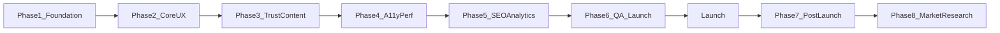

# ViableMHR Phased Build Plan (Launch Order of Operations)

Derived from the product audit on branch `updated-main`. **No monetization.** **No code in this document**—implementation follows phase order after approval.

---

## Phase 1: Product foundation

Establish scope, ops, and architectural decisions before UX/content polish.

---

### 1.1 Define launch success criteria and scope document

**Goal:** Write a one-page internal doc: target users, in-scope features, explicit out-of-scope (no diagnosis, no booking, no paid ranking), and 5–7 measurable success signals (zero-result rate, submit completion, program detail views, crisis path usage).

**Why it matters:** Prevents scope creep and gives post-launch evaluation criteria.

**Files/components:** New doc (e.g. `docs/product/LAUNCH_SCOPE.md`); references [src/html/index.html](src/html/index.html), [src/js/config/constants.js](src/js/config/constants.js)

**Acceptance criteria:** Document approved; success metrics listed; monetization explicitly deferred.

**Manual testing:** N/A (documentation).

**Difficulty:** Low | **Required before launch:** Yes

**Risks / do not break:** Do not add revenue features while defining scope.

---

### 1.2 Document submit-to-publish operational runbook

**Goal:** Document the end-to-end path: Formspree intake → human review → `programs.json` update → `validate-data.js` / `validate-filters.js` → build → deploy.

**Why it matters:** Directory freshness and submission handling are operational launch blockers.

**Files/components:** [src/js/submit.js](src/js/submit.js), [public/data/programs.json](public/data/programs.json), [scripts/validate-data.js](scripts/validate-data.js), [scripts/build.js](scripts/build.js), optional [functions/api/submit-program.js](functions/api/submit-program.js)

**Acceptance criteria:** Runbook names owner, SLA target, validation commands (`npm run validate-filters`, `npm run verify`), and rollback steps; confirms **Formspree is production path** (or documents switch to Cloudflare function).

**Manual testing:** Walk through a test submission in staging; confirm it appears in Formspree and runbook steps are accurate.

**Difficulty:** Medium | **Required before launch:** Yes

**Risks / do not break:** Do not expose secrets in runbook; do not auto-publish submissions without review.

---

### 1.3 Standardize program URL strategy

**Goal:** Decide and document canonical share URL: `/programs/{id}.html` (preferred) vs legacy `program.html?id=` vs home `?program=`.

**Why it matters:** Inconsistent URLs confuse users, hurt SEO, and break shared links.

**Files/components:** [src/js/utils/helpers.js](src/js/utils/helpers.js) (`programPublicPath`), [src/app.js](src/app.js) (`shareProgram` currently uses `?program=`), [scripts/generate-program-pages.js](scripts/generate-program-pages.js), [_redirects](_redirects)

**Acceptance criteria:** Written rule: card links, share modal, and canonical tags all target slug URLs; legacy URLs redirect or still resolve.

**Manual testing:** Share from card → open in new tab → correct program; old `?program=` links still work if retained.

**Difficulty:** Medium | **Required before launch:** Yes (decision); implementation may span Phase 2

**Risks / do not break:** Existing bookmarked URLs; [src/js/program-detail.js](src/js/program-detail.js) ID resolution from slug/`?id=`/`__ViableMHRProgramId`.

---

### 1.4 Verify production admin and deploy configuration

**Goal:** Confirm Cloudflare Access on `/admin.html`, `X-Robots-Tag: noindex`, and deploy includes `sitemap-programs.xml` from build.

**Why it matters:** Admin exposure and missing sitemaps are security/SEO risks.

**Files/components:** [_headers](_headers), [public/robots.txt](public/robots.txt), [src/html/admin.html](src/html/admin.html), [scripts/generate-program-pages.js](scripts/generate-program-pages.js)

**Acceptance criteria:** Unauthenticated users cannot access admin in prod; both sitemaps return 200; admin not indexed.

**Manual testing:** Hit `/admin.html` logged out (expect Access gate); fetch `/sitemap-programs.xml` after deploy.

**Difficulty:** Low | **Required before launch:** Yes

**Risks / do not break:** Do not remove security headers; do not index admin.

---

### 1.5 Add About page to information architecture (shell only)

**Goal:** Add `about.html` to sitemap/navigation plan: who VMHR is, neutrality policy, verification summary, contact—linked from footer and trust strip.

**Why it matters:** Trust gap identified in audit; email-only contact in legal pages is insufficient for crisis-adjacent product.

**Files/components:** New [src/html/about.html](src/html/about.html) (Phase 3 fills content); [public/sitemap.xml](public/sitemap.xml); footer blocks in [src/html/index.html](src/html/index.html), [src/html/guides.html](src/html/guides.html)

**Acceptance criteria:** IA diagram updated; nav/footer link targets defined; page stub or placeholder in build pipeline if not full content yet.

**Manual testing:** Footer link resolves; page has skip link + `#main` matching other legal pages.

**Difficulty:** Low | **Required before launch:** No (full content Phase 3); IA decision Yes

**Risks / do not break:** Do not imply clinical endorsement or paid partnerships.

---

## Phase 2: Core user experience

Fix friction in primary discovery flows without changing filter business logic.

---

### 2.1 Clarify results-unlock journey (intent → search → results)

**Goal:** Make it obvious that programs appear after **Find Programs** or **Browse all**, while presets/unlock paths show results immediately.

**Why it matters:** Users abandon when cards stay hidden after choosing intent or opening search.

**Files/components:** [src/app.js](src/app.js) (`resultsUnlocked`, `updateResultsAwaitingCopy`), [src/html/index.html](src/html/index.html) (`#resultsAwaiting`, `#browseAllPrograms`), [src/js/modules/home-phase1.js](src/js/modules/home-phase1.js)

**Acceptance criteria:** Awaiting panel copy matches intent; after preset click, results visible without extra Find Programs click (already fixed for presets—verify); first-time user path documented in UI microcopy.

**Manual testing:** Fresh load → treatment card → search reveals → Find Programs → cards; preset from specialized section → cards without Find Programs; Browse all → full list.

**Difficulty:** Medium | **Required before launch:** Yes

**Risks / do not break:** Do not auto-show all programs on first paint (product decision to gate); crisis flow unchanged.

---

### 2.2 Unify program share URLs to slug pages

**Goal:** Change `shareProgram()` to share `https://viablemhr.com/programs/{id}.html` instead of `?program=` on homepage.

**Why it matters:** Aligns user shares with SEO canonical URLs ([src/js/program-detail.js](src/js/program-detail.js) already sets canonical to slug).

**Files/components:** [src/app.js](src/app.js) (`shareProgram`), [src/js/utils/helpers.js](src/js/utils/helpers.js), QR generation in share modal

**Acceptance criteria:** Share modal URL uses slug path; QR encodes slug URL; `?program=` deep-link on home still works for backward compatibility.

**Manual testing:** Share program → copy link → open in incognito → lands on correct slug page.

**Difficulty:** Low | **Required before launch:** Important (Yes if sharing is launch feature)

**Risks / do not break:** [src/app.js](src/app.js) `handleURLParams` for `?program=` expansion on home.

---

### 2.3 Submit page navigation and orientation

**Goal:** Add header link “Back to search” on [src/html/submit.html](src/html/submit.html); ensure submit wizard exit path is clear.

**Why it matters:** Submit is a dead-end in current IA.

**Files/components:** [src/html/submit.html](src/html/submit.html), [src/js/submit.js](src/js/submit.js)

**Acceptance criteria:** Visible link to `index.html` in header; mobile layout unaffected.

**Manual testing:** Complete and abandon submit flow; back link works from step 1 and after success.

**Difficulty:** Low | **Required before launch:** No

**Risks / do not break:** Form wizard state; draft save in `localStorage.directoryDraft`.

---

### 2.4 External link accessibility (new tab disclosure)

**Goal:** Add visually hidden “(opens in new tab)” or `aria-label` suffix on external links (SAMHSA 988, program websites, verified sources, maps).

**Why it matters:** WCAG 2.4.4 / 3.2.2 advisory; screen reader users should know context changes.

**Files/components:** [src/html/index.html](src/html/index.html), [src/html/guides.html](src/html/guides.html), [src/html/program.html](src/html/program.html), [src/js/modules/render.js](src/js/modules/render.js)

**Acceptance criteria:** All `target="_blank"` links have accessible name disclosure; no duplicate verbose text for sighted users.

**Manual testing:** VoiceOver/NVDA on crisis SAMHSA link and card website link.

**Difficulty:** Low | **Required before launch:** No

**Risks / do not break:** Link styling; `rel="noopener noreferrer"` preserved.

---

### 2.5 Filter tray focus return parity

**Goal:** Match modal focus-trap quality for mobile filter tray: trap Tab, Escape closes, focus returns to `#openFilterTray`.

**Why it matters:** Mobile filter path is primary on small screens; audit noted weaker focus return vs main modals.

**Files/components:** [src/js/modules/home-phase1.js](src/js/modules/home-phase1.js), [src/html/index.html](src/html/index.html) (`#filterTrayOverlay`)

**Acceptance criteria:** Keyboard-only user can open tray, adjust filter, close, and return to trigger; no focus lost to `body`.

**Manual testing:** Mobile viewport → open Filters → Tab through controls → Escape → focus on Filters button.

**Difficulty:** Medium | **Required before launch:** No

**Risks / do not break:** Desktop `#showAdvanced` path; filter chip sync in [src/js/modules/events.js](src/js/modules/events.js).

---

### 2.6 Guides copy-checklist feedback

**Goal:** Add `aria-live="polite"` confirmation when “Copy checklist” succeeds on [src/html/guides.html](src/html/guides.html).

**Why it matters:** Non-visual users get no feedback after copy action.

**Files/components:** [src/html/guides.html](src/html/guides.html), copy handler script in guides or [src/js/modules/home-phase1.js](src/js/modules/home-phase1.js) if shared

**Acceptance criteria:** Successful copy announces “Checklist copied”; failure announces error.

**Manual testing:** Copy checklist with screen reader enabled.

**Difficulty:** Low | **Required before launch:** No

**Risks / do not break:** Clipboard API fallback on non-HTTPS local dev.

---

## Phase 3: Content, trust, and data quality

Align copy with reality; improve credibility and data transparency.

---

### 3.1 Fix trust strip vs analytics mismatch (critical)

**Goal:** Update homepage trust strip “No ads or third-party tracking” to accurate language (e.g. “No ads or marketing trackers; minimal privacy-respecting analytics”).

**Why it matters:** **Launch blocker**—current copy contradicts Statcounter on [src/html/index.html](src/html/index.html) and other pages.

**Files/components:** [src/html/index.html](src/html/index.html) (lines ~165–166), optionally [public/phase1-design.css](public/phase1-design.css)

**Acceptance criteria:** Trust strip claims match actual scripts loaded; no false “zero tracking” statement.

**Manual testing:** Read trust strip; view page source for Statcounter; confirm wording is honest.

**Difficulty:** Low | **Required before launch:** Yes

**Risks / do not break:** Overall trust tone; do not remove crisis disclaimers.

---

### 3.2 Update privacy policy for Statcounter and QR service

**Goal:** Name Statcounter in [src/html/privacy.html](src/html/privacy.html) §5 (Cookies and Tracking); clarify aggregate page analytics vs marketing trackers.

**Why it matters:** Legal/trust alignment with actual behavior.

**Files/components:** [src/html/privacy.html](src/html/privacy.html)

**Acceptance criteria:** Privacy policy accurately lists Statcounter, Formspree, Cloudflare, QR server; “no marketing trackers” only if true.

**Manual testing:** Legal review (if available); cross-check against loaded scripts on each page.

**Difficulty:** Low | **Required before launch:** Yes

**Risks / do not break:** Do not weaken PHI/submission warnings in §2.

---

### 3.3 Build About / methodology page content

**Goal:** Publish [src/html/about.html](src/html/about.html): VMHR mission, how listings are verified (90-day cycle), neutrality (no paid ranking), how to submit updates, contact email.

**Why it matters:** Fills largest trust gap; supports institutional referrers.

**Files/components:** New about.html; link from footer on all main pages; [public/sitemap.xml](public/sitemap.xml)

**Acceptance criteria:** Page live with skip link, `#main`, h1; links to [src/html/submit.html](src/html/submit.html) and [src/html/guides.html](src/html/guides.html); verification explained in plain language.

**Manual testing:** Read page as unfamiliar caregiver; confirm no clinical promises.

**Difficulty:** Medium | **Required before launch:** Important (Yes for trust-sensitive launch)

**Risks / do not break:** Do not claim FDA/clinical accreditation; cite [src/js/data-validator.js](src/js/data-validator.js) rules accurately.

---

### 3.4 User-facing verification explanation on cards and detail

**Goal:** Standardize microcopy for “Verified” badges: what it means, 90-day refresh, link to About methodology.

**Why it matters:** “Verified” without definition can mislead users about clinical quality.

**Files/components:** [src/js/modules/render.js](src/js/modules/render.js), [src/js/program-detail.js](src/js/program-detail.js), [src/html/about.html](src/html/about.html)

**Acceptance criteria:** Card and detail show verification date + short tooltip or link “What verified means”; stale programs visually distinct if recency data exists.

**Manual testing:** Expand card; open program detail; verify date format and link work.

**Difficulty:** Medium | **Required before launch:** No

**Risks / do not break:** Sort by “Recently verified” in [src/app.js](src/app.js); do not hide stale programs without UX notice.

---

### 3.5 Submit page SEO meta and header consistency

**Goal:** Add `<meta name="description">` to [src/html/submit.html](src/html/submit.html); align title/OG with other pages.

**Why it matters:** Audit gap; submit is a key conversion page for data quality.

**Files/components:** [src/html/submit.html](src/html/submit.html)

**Acceptance criteria:** Unique description (~150 chars); OG tags present if used elsewhere.

**Manual testing:** View source; Lighthouse SEO on submit page.

**Difficulty:** Low | **Required before launch:** No

**Risks / do not break:** CSP meta block unchanged.

---

### 3.6 Footer “last updated” reliability

**Goal:** Ensure `#lastUpdated` in [src/app.js](src/app.js) always shows meaningful date from `programs.json` metadata or build timestamp.

**Why it matters:** Empty footer date undermines freshness signal.

**Files/components:** [src/app.js](src/app.js) (~3637), [public/data/programs.json](public/data/programs.json) metadata

**Acceptance criteria:** Homepage footer shows “Program list updated: {date}” when data loads; graceful fallback copy when metadata missing.

**Manual testing:** Load home with/without metadata field.

**Difficulty:** Low | **Required before launch:** No

**Risks / do not break:** Do not show incorrect dates from partial loads.

---

## Phase 4: Mobile, accessibility, and performance

Harden inclusive access and perceived speed on real devices.

---

### 4.1 Multi-page Lighthouse and accessibility regression gate

**Goal:** Run Lighthouse on home, guides, submit, program slug, privacy—not just homepage ([lighthouserc.json](lighthouserc.json) currently home-only).

**Why it matters:** Recent fixes hit 100 on 8 pages locally; CI should guard regressions.

**Files/components:** [lighthouserc.json](lighthouserc.json), [package.json](package.json) `verify` script

**Acceptance criteria:** CI or documented manual gate: accessibility ≥95 all priority pages; document scores in launch checklist.

**Manual testing:** `npm run verify` or manual Lighthouse on listed URLs from `dist/`.

**Difficulty:** Medium | **Required before launch:** Yes

**Risks / do not break:** Do not lower thresholds to pass; fix regressions.

---

### 4.2 Add axe-core to Playwright (smoke paths)

**Goal:** Integrate `@axe-core/playwright` on homepage (search revealed), filter tray open, one modal open.

**Why it matters:** Automated catch of contrast/ARIA regressions beyond Lighthouse.

**Files/components:** [tests/smoke.spec.js](tests/smoke.spec.js), [playwright.config.js](playwright.config.js)

**Acceptance criteria:** Zero critical/serious violations on defined states; runs in CI.

**Manual testing:** Introduce intentional violation in branch → test fails → revert.

**Difficulty:** Medium | **Required before launch:** No

**Risks / do not break:** Flaky tests from dynamic content; scope to stable states.

---

### 4.3 Manual keyboard and screen reader checklist execution

**Goal:** Execute audit checklist §I on staging/production: skip link, combobox, modals, filter tray, submit wizard.

**Why it matters:** Automated tools miss focus order and live region quality.

**Files/components:** All [src/html/*.html](src/html), [src/js/modules/render.js](src/js/modules/render.js), [src/js/modules/home-phase1.js](src/js/modules/home-phase1.js)

**Acceptance criteria:** Documented pass/fail log; all **critical** paths pass (search, results, program detail, crisis links).

**Manual testing:** Tab-only navigation; VoiceOver on iOS Safari; one Android Chrome spot check.

**Difficulty:** Medium | **Required before launch:** Yes

**Risks / do not break:** Reduced-motion paths ([public/phase1-design.css](public/phase1-design.css)); combobox in [src/app.js](src/app.js).

---

### 4.4 Mobile real-device QA (filter tray + results)

**Goal:** Validate mobile filter tray, horizontal trust strip scroll, card tap targets, results overflow menu on iOS Safari and Android Chrome.

**Why it matters:** Primary audience likely mobile; Playwright WebKit flakes noted in audit.

**Files/components:** [public/phase1-design.css](public/phase1-design.css), [tests/mobile.spec.js](tests/mobile.spec.js), [tests/helpers/ui.js](tests/helpers/ui.js)

**Acceptance criteria:** No horizontal page overflow; Filters usable; Call/Details buttons ≥44px; no content trapped behind fixed bars.

**Manual testing:** Physical devices or BrowserStack; run [tests/mobile.spec.js](tests/mobile.spec.js) as baseline.

**Difficulty:** Medium | **Required before launch:** Yes

**Risks / do not break:** Dual filter UX (tray vs desktop advanced)—test mobile path only on mobile.

---

### 4.5 Performance baseline and font loading

**Goal:** Measure LCP/INP/CLS on throttled mobile for home + program slug; defer or self-host Google Fonts if LCP regresses.

**Why it matters:** Full `programs.json` + ~15 scripts + font CDN affect low-end devices.

**Files/components:** [src/html/index.html](src/html/index.html) (font links), [scripts/build.js](scripts/build.js), [public/sw.js](public/sw.js)

**Acceptance criteria:** Document baseline scores; LCP <2.5s on simulated 4G or documented exception with mitigation plan.

**Manual testing:** Chrome DevTools throttling; WebPageTest optional.

**Difficulty:** High | **Required before launch:** No (monitor post-launch if acceptable)

**Risks / do not break:** SW must not cache stale HTML/JS ([public/sw.js](public/sw.js) design).

---

## Phase 5: SEO, analytics, and feedback

Discoverability and measurement without compromising trust.

---

### 5.1 Fix sitemap completeness

**Goal:** Add [src/html/guides.html](src/html/guides.html) and [about.html](about.html) to [public/sitemap.xml](public/sitemap.xml); remove or demote legacy [program.html](src/html/program.html) entry if slug pages are canonical; ensure build outputs [sitemap-programs.xml](dist/sitemap-programs.xml).

**Why it matters:** Guides is high-value content currently omitted from sitemap.

**Files/components:** [public/sitemap.xml](public/sitemap.xml), [public/robots.txt](public/robots.txt), [scripts/generate-program-pages.js](scripts/generate-program-pages.js)

**Acceptance criteria:** `guides.html` and about in sitemap; both sitemap URLs return 200 in prod; lastmod dates updated.

**Manual testing:** Fetch sitemaps; submit to Search Console (manual ops).

**Difficulty:** Low | **Required before launch:** Yes

**Risks / do not break:** Do not sitemap admin; keep Disallow in robots.txt.

---

### 5.2 Static page canonical URLs and OG consistency

**Goal:** Add `<link rel="canonical">` to index, guides, submit, about, privacy, terms; add OG tags to guides (missing per audit).

**Why it matters:** Prevents duplicate URL confusion; improves link previews.

**Files/components:** [src/html/guides.html](src/html/guides.html), other static HTML pages, [src/js/config/constants.js](src/js/config/constants.js) `SITE` base URL

**Acceptance criteria:** Each static page has canonical pointing to `https://viablemhr.com/...`; guides has og:title/description.

**Manual testing:** View source; Facebook/Twitter debugger optional.

**Difficulty:** Low | **Required before launch:** No

**Risks / do not break:** Program detail dynamic canonical in [src/js/program-detail.js](src/js/program-detail.js) takes precedence on slug pages.

---

### 5.3 Statcounter parity on guides

**Goal:** Add Statcounter snippet to [src/html/guides.html](src/html/guides.html) if analytics policy retains Statcounter—or document intentional omission.

**Why it matters:** Inconsistent analytics undercounts guide traffic.

**Files/components:** [src/html/guides.html](src/html/guides.html) (CSP already allows Statcounter)

**Acceptance criteria:** Policy decision documented; implementation matches policy.

**Manual testing:** Load guides; confirm counter fires or omission is intentional.

**Difficulty:** Low | **Required before launch:** No

**Risks / do not break:** Must align with Phase 3 privacy copy updates.

---

### 5.4 Define post-launch analytics event plan (privacy-preserving)

**Goal:** Document events to track later (not full implementation): zero-result searches, preset usage, Find Programs clicks, call clicks aggregate, submit funnel—without PII in logs.

**Why it matters:** Product improvement requires signal; must be designed with privacy policy alignment.

**Files/components:** New doc `docs/product/ANALYTICS_PLAN.md`; references [src/app.js](src/app.js), [src/js/modules/empty-state.js](src/js/modules/empty-state.js)

**Acceptance criteria:** Event list + privacy review checklist; no user query text stored server-side without consent/hashing plan.

**Manual testing:** N/A (planning only).

**Difficulty:** Low | **Required before launch:** No (plan Yes before scaling traffic)

**Risks / do not break:** No monetization pixels; no cross-context ad tracking.

---

### 5.5 “Report outdated listing” intake design (stub)

**Goal:** Design lightweight feedback path (mailto link or submit form anchor)—implementation optional pre-launch.

**Why it matters:** Data quality maintenance; user trust when they spot errors.

**Files/components:** [src/html/about.html](src/html/about.html), [src/js/modules/render.js](src/js/modules/render.js) (future card action)

**Acceptance criteria:** At minimum, About page explains how to report errors via email or submit; no automated pipeline required for launch.

**Manual testing:** Click report path; reaches viable email or submit with context.

**Difficulty:** Low | **Required before launch:** No

**Risks / do not break:** Do not collect PHI in free-text reports without warning.

---

## Phase 6: QA and launch readiness

Formal verification before public launch.

---

### 6.1 Expand Playwright coverage for submit and guides

**Goal:** Add smoke tests: submit wizard validation (required fields), guides internal links, about page links.

**Why it matters:** Submit and guides untested in current suite (~44 tests elsewhere).

**Files/components:** New or extended specs in [tests/](tests/), [src/html/submit.html](src/html/submit.html), [src/html/guides.html](src/html/guides.html)

**Acceptance criteria:** CI green; submit rejects empty required step; guides links to index work.

**Manual testing:** Run `npx playwright test` on desktop project.

**Difficulty:** Medium | **Required before launch:** Important

**Risks / do not break:** Do not POST real Formspree in CI—mock or stop before submit.

---

### 6.2 Execute full manual QA checklist (audit §I)

**Goal:** Run complete checklist: crisis, all intent paths, smart search cases (`PHP in Frisco for a 14 year old`), favorites/compare, URL restore, program slug, submit draft.

**Why it matters:** Final human gate beyond automation.

**Files/components:** Entire app; checklist stored in `docs/QA_LAUNCH_CHECKLIST.md`

**Acceptance criteria:** Signed checklist with date, tester, environment; all **Required before launch: Yes** items pass.

**Manual testing:** Full §I from audit document.

**Difficulty:** Medium | **Required before launch:** Yes

**Risks / do not break:** Test on production-like build (`npm run build` + preview), not dev-only paths.

---

### 6.3 Broken link and console error crawl

**Goal:** Crawl dist/ internal links; verify no fatal console errors on primary pages.

**Why it matters:** Broken links erode trust; JS errors break search.

**Files/components:** [dist/](dist/) output, [tests/smoke.spec.js](tests/smoke.spec.js)

**Acceptance criteria:** Zero broken internal links on priority pages; smoke spec passes on CI.

**Manual testing:** `npm run verify`; optional link checker script on dist.

**Difficulty:** Low | **Required before launch:** Yes

**Risks / do not break:** External links (SAMHSA, maps) may fail independently—document as external.

---

### 6.4 Cross-browser spot check

**Goal:** Verify Chrome, Firefox, Safari (desktop + iOS) on homepage search and program detail.

**Why it matters:** Combobox and `inert` panel behavior varies by browser.

**Files/components:** [src/app.js](src/app.js), [src/js/modules/render.js](src/js/modules/render.js)

**Acceptance criteria:** Search, filter, expand card, open slug detail work in all three engines.

**Manual testing:** One session per browser; note failures in QA log.

**Difficulty:** Medium | **Required before launch:** Yes

**Risks / do not break:** Safari `inert` and focus; test collapse/expand panels.

---

### 6.5 Launch day deploy checklist

**Goal:** Single runbook: build, validate-data, validate-filters, deploy, verify sitemaps, smoke prod URLs, monitor Formspree.

**Why it matters:** Prevents partial deploys (missing program slugs or sitemap-programs).

**Files/components:** [package.json](package.json), [scripts/build.js](scripts/build.js), Cloudflare Pages config

**Acceptance criteria:** Checklist executed once on staging dry-run; once on prod launch.

**Manual testing:** Dry-run deploy to staging; verify 3 random `/programs/{id}.html` URLs.

**Difficulty:** Low | **Required before launch:** Yes

**Risks / do not break:** Cache invalidation; SW update behavior.

---

## Phase 7: Post-launch iteration

After launch, improve maintainability and data loop—still no monetization.

---

### 7.1 Zero-result search monitoring (manual → automated)

**Goal:** Weekly review of common zero-result queries (from analytics plan or manual search logs); tune presets and city list.

**Why it matters:** Search quality is core product value.

**Files/components:** [src/js/modules/search.js](src/js/modules/search.js), [src/js/config/constants.js](src/js/config/constants.js) `FILTER_PRESETS`, [public/data/programs.json](public/data/programs.json)

**Acceptance criteria:** First monthly report with top 10 zero-result queries and actions taken.

**Manual testing:** Run known failing queries after data/copy fixes.

**Difficulty:** Medium | **Required before launch:** No

**Risks / do not break:** Do not loosen filters in ways that show irrelevant crisis resources incorrectly.

---

### 7.2 Verification recency UI (feature flag)

**Goal:** Enable `SHOW_VERIFICATION_FILTERS` when ready; surface stale listings visually.

**Why it matters:** 90-day rule exists in validator but UI flag is off.

**Files/components:** [src/js/config/constants.js](src/js/config/constants.js), [src/js/modules/filters.js](src/js/modules/filters.js), [src/html/index.html](src/html/index.html)

**Acceptance criteria:** Filter works; copy explains stale data; validate-filters tests pass.

**Manual testing:** Filter “verified within 90 days”; card counts change sensibly.

**Difficulty:** Medium | **Required before launch:** No

**Risks / do not break:** Programs without verification dates—handle gracefully.

---

### 7.3 Frontend maintainability: module bundle evaluation

**Goal:** Spike ES module + single bundle via [scripts/build.js](scripts/build.js) to reduce 15-script waterfall; no user-facing change.

**Why it matters:** [src/app.js](src/app.js) monolith + globals hinder iteration.

**Acceptance criteria:** Spike doc with bundle size comparison and load time; decision to adopt or defer.

**Manual testing:** Compare network waterfall before/after on throttled mobile.

**Difficulty:** High | **Required before launch:** No

**Risks / do not break:** Global `window.*` API used across modules; migration must be incremental.

---

### 7.4 CSP hardening roadmap

**Goal:** Move CSP to [_headers](_headers); remove `unsafe-inline` by externalizing Statcounter or using nonce strategy.

**Why it matters:** Security posture; audit flagged weak CSP.

**Files/components:** [_headers](_headers), all HTML CSP meta tags, Statcounter snippets

**Acceptance criteria:** Documented phases; Phase A: duplicate CSP in headers matching meta; Phase B: tighten script-src.

**Manual testing:** CSP violation console clean on all pages after each phase.

**Difficulty:** High | **Required before launch:** No

**Risks / do not break:** Inline scripts on every page break if CSP tightened without migration.

---

### 7.5 Design system token unification

**Goal:** Merge `--vm-*` and legacy `--ink`/`--muted` tokens; document component ownership in one CSS layer.

**Why it matters:** Reduces visual drift between legal pages and Phase 1 home.

**Files/components:** [public/styles.css](public/styles.css), [public/phase1-design.css](public/phase1-design.css)

**Acceptance criteria:** Single token reference doc; legal pages use same muted contrast as home.

**Manual testing:** Visual regression on home, privacy, guides.

**Difficulty:** Medium | **Required before launch:** No

**Risks / do not break:** Contrast ratios post-merge—re-run Lighthouse.

---

## Phase 8: Future market analysis (deferred research only)

**No implementation.** Use findings to inform Phase 7+ backlog and About/methodology language—not to copy monetization or ranking schemes.

### 8.1 Competitor websites to study

| Site / category | Why study |
|-----------------|-----------|
| SAMHSA Treatment Locator / FindTreatment.gov | Federal neutral directory baseline |
| Psychology Today provider directory | High-traffic mental health search UX |
| NAMI resource pages | Family-facing trust and education tone |
| State HHSC / Texas-specific youth resources | Regional compliance and coverage gaps |
| Hospital network find-a-doctor (Children’s, UT Southwestern) | Care level taxonomy and program detail depth |
| Substance use: SAMHSA OTP/BUP locator patterns | SUD-specific filters |
| Eating disorder nonprofits (NEDA historical patterns, ANAD) | Condition-specific directory UX |
| General healthcare directories (Healthgrades, Zocdoc) | Search/filter patterns—**do not copy pay models** |

### 8.2 Their apparent business models (observe only)

- Lead generation / referral fees (Psychology Today-style)
- Provider subscription for enhanced profiles
- Ad-supported content networks
- Government/grant-funded neutral directories
- Health system marketing (single-system funnels)
- Nonprofit donation-funded information hubs

**Document:** Which models align vs. conflict with ViableMHR neutrality principles.

### 8.3 UX/UI strengths to note

- Faceted search clarity
- Map + list dual views
- Care level education inline
- Mobile call-first CTAs
- Insurance filter prominence
- Waitlist/availability signaling (if shown)
- Crisis resource placement
- Empty-state suggestions

### 8.4 UX/UI weaknesses to note

- Pay-to-rank opacity
- Listing freshness unclear
- Clinical claims without disclaimers
- Overwhelming filter walls
- Account walls before viewing details
- Aggressive retargeting
- Poor mobile filter patterns

### 8.5 Trust and credibility signals to compare

- About/editorial team visibility
- Verification methodology published
- Last-updated dates on listings
- Source links per field
- Neutrality statements
- Privacy policy clarity
- Crisis disclaimers
- User review authenticity (and manipulation risk)

### 8.6 SEO strategy observations

- City + care level landing pages
- Program slug URL patterns
- JSON-LD types used
- Sitemap scale and update frequency
- Content hubs (guides) linking to directory
- Branded vs. non-branded keyword targeting

### 8.7 Directory/search feature inventory

- Natural language search
- Age/insurance/care level filters
- Telehealth toggles
- Distance sort
- Compare/save
- Crisis toggles
- OSAR/referral special cases (ViableMHR already has domain logic)
- Multi-location programs
- Service area models (county vs. point)

### 8.8 What could inspire future improvements (not launch scope)

- City landing pages (“IOP in Plano”) as static SEO content linking into search prefill
- Report-outdated flow with structured fields
- Navigator-focused printable PDF export
- School counselor bulk resource sheets
- Verification badge tiers (source documented vs. phone confirmed)
- Aggregate anonymous search analytics dashboard for gaps

### 8.9 What should NOT be copied

- Paid placement or “featured provider” slots
- Star ratings without moderation
- Provider-paid verification badges
- Lead sale to treatment centers
- Aggressive intake forms collecting PHI
- Dark patterns pushing specific providers
- Hidden affiliate links
- Account requirement to view phone numbers

### 8.10 Legal, ethical, privacy, and healthcare-compliance review topics

- FTC guidance on health directory claims
- HIPAA: directory vs. intake (when user submits PHI)
- Texas HHSC licensing references for program types
- 42 CFR Part 2 considerations for SUD listings (display, not collection)
- Crisis liability disclaimers adequacy
- Minors’ privacy in local storage features
- COPPA if targeting under-13 user accounts (avoid accounts)
- ADA/WCAG ongoing compliance for public resource
- State false advertising rules for “verified” claims
- GDPR/CCPA if traffic expands beyond Texas (minimal collection posture today)

### Phase 8 deliverable (research output only)

Single markdown report: `docs/research/MARKET_ANALYSIS_YYYY.md` with comparison matrix, inspiration backlog (tagged Phase 7+), and explicit “do not copy” list—**no code changes**.

---

## Summary: Launch-critical path (Phases 1–6 minimum)

| Priority | Tasks |
|----------|--------|
| **Must ship** | 1.2 runbook, 1.3 URL decision, 1.4 admin/deploy, 3.1 trust strip, 3.2 privacy, 2.1 results journey verify, 5.1 sitemap, 6.2–6.5 QA/deploy |
| **Strongly recommended** | 3.3 About page, 2.2 slug share URLs, 4.1–4.4 a11y/mobile QA, 6.1 Playwright expand |
| **Post-launch** | Phase 7 items, Phase 8 research |

**Overall audit verdict carried forward:** Partially on track → **launch-ready after Phase 1.2, 1.4, 3.1, 3.2, 5.1, and Phase 6 QA complete.**
