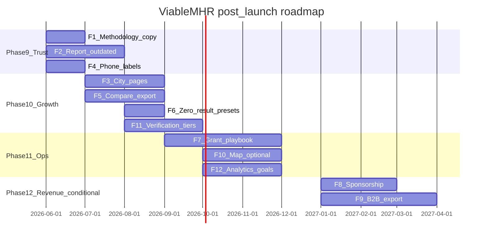

# ViableMHR Market-Informed Implementation Strategy (2026)

**Document type:** Internal analytical implementation report — not published to viablemhr.com  
**Audience:** Product, operations, data, and leadership stakeholders  
**Market snapshot date:** 2026-05-25 (public competitor pages)

**Disclaimer:** Strategy and implementation planning only. Not legal advice. Not clinical advice. Claims marked **Unspecified** where evidence was not available. Revenue projections are **Unspecified** until grant or B2B pipelines are modeled.

**Deployment note:** `docs/` is not copied to `dist/` by the build pipeline.

---

## Executive Summary

ViableMHR occupies a **underserved** niche: a **neutral, youth-focused, program-level** directory for PHP/IOP/outpatient navigation in North Texas, with verification freshness UX and no accounts. The broader market is **overserved** by individual-therapy directories, insurance marketplaces, and DTC teletherapy—models that conflict with VMHR launch-scope neutrality ([LAUNCH_SCOPE.md](../product/LAUNCH_SCOPE.md)).

**Strategic conclusion:** Maximize **durable, trust-compatible** value before revenue. Hard gates eliminate most competitor monetization patterns (listing fees, take-rates, lead-gen, ads, opaque sponsorship, pay-per-admission). **Recommend Now** work is overwhelmingly **non-monetization**: transparency, freshness tooling, navigator UX, SEO education pages, and privacy-preserving analytics. **Recommend Later** revenue is limited to **grants/donations** and **conditional B2B/educational sponsorship** after legal/ethics review—not paid ranking or referral economics.

**Top five prioritized moves (post-launch Phases 9–10):**

1. **Expand methodology and ranking transparency** on About/trust surfaces (trust gap vs opaque directories).
2. **Structured report-outdated intake** (freshness gap vs federal locator accuracy concerns and stale local program sites).
3. **City + care-level education pages** with pre-filled search (SEO gap vs therapist-directory local pages; education only, not booking).
4. **Intake vs crisis phone labels** on all program cards and detail pages.
5. **Navigator compare export** (print/PDF packet for discharge handoff).

**Explicit non-recommendation:** Provider subscriptions, sponsored listings in core search, session take-rates, lead sale, display/retargeting ads, booking marketplaces, and clinical matching quizzes—**Do Not Recommend** per hard gates below.

**Revenue outlook:** **Unspecified** in provided inputs (no budget, pricing tests, or payer mix). Gate-passing options (grants, labeled educational sponsorship, B2B data services without referral fees) may yield modest, slow revenue; **trust and usage growth should be weighted above short-term earnings.**

---

## What the market shows

### Cluster narrative

| Cluster | Representative sites | Dominant model | Fit for VMHR users |
|---------|---------------------|----------------|-------------------|
| **Therapist directories** | Psychology Today, TherapyDen, Mental Health Match | Listing fees or premium visibility; individual profiles | **Poor** — no PHP/IOP program compare |
| **Appointment / insurance marketplaces** | Zocdoc, Headway, Alma, Grow Therapy | Provider-side fees, take-rates, payer contracts | **Poor** — booking and session economics |
| **DTC teletherapy** | BetterHelp, Talkspace | Subscriptions, payor/employer B2B2C | **Poor** — wrong care setting; quiz PHI risk |
| **Public / nonprofit** | FindTreatment.gov, NAMI, Texas HHSC | Gov survey or donations; education/support | **Partial** — national or system entry, not youth program compare |
| **Local program marketing** | Carrollton Springs, Connections Wellness, Reflections, Texas Health | Admission to own programs | **Partial** — care-level language good; no neutral cross-org compare |

**Cross-cutting patterns:** Insurance-first discovery; geo-first search; crisis siloed on nonprofits/gov; verification = credentialing or surveys, rarely call-confirmed dates; platform-subsidized directory listings (Grow + Psychology Today) blur ranking without clear sponsorship labels.

### Competitor comparison

**Unspecified** = not observed in public research for that site.

---

### Table 1: Competitor comparison

| # | Site | Audience | Revenue model | UX strengths | UX weaknesses | SEO strengths | SEO weaknesses | Trust signals | A11y / performance notes | Privacy / compliance notes | Differentiators vs VMHR |
|---|------|----------|---------------|--------------|---------------|---------------|----------------|---------------|--------------------------|----------------------------|-------------------------|
| 1 | Psychology Today | Therapy seekers; therapists listing | ~$29.95/mo listing fee (**Conflict**) | Rich insurance/specialty filters; polished profiles | Clinician-not-program; dense mobile filters; opaque sort | Dominant local therapist SEO | No youth PHP/IOP taxonomy | Brand authority; license implied | Responsive; WCAG not audited here | Listing fee; Grow/Alma subsidized listings | National therapist depth |
| 2 | Zocdoc | Appointment bookers | Marketplace (**Conflict**); provider-side economics | Insurance + availability + map | Booking-first; accounts; wrong for program compare | City × specialty landings | Care level weak | In-network “verified” | Strong mobile booking UX | Unspecified consumer data sale | Real-time slots |
| 3 | Headway | Insured therapy seekers; providers | Session take-rate (**Conflict**); anti-kickback flag | Cost estimate before book | Not facility directory; take-rate opaque to users | Therapy + insurance keywords | No program cards | Payer logos; credentialing | Modern SaaS UX | Referral/payer contracting risk | Insurance admin outsourcing |
| 4 | Alma | Therapists; in-network clients | ~$125/mo membership (**Conflict**) | Consult-before-book; calm UI | Member-only directory; mandatory insurance program for new providers | Provider recruitment SEO | Not comprehensive map | Credentialing; crisis footer | Professional marketing site | Payer contracting; minor telehealth consent | Practice OS + directory |
| 5 | Grow Therapy | Insured clients; providers | Session cut + pays PT listings (**Conflict**) | Insurance scale; admin bundle | Dual role platform/directory operator; duplicate PT profiles | Aggressive SEO + directories | Not program-level | Employer/payer marketing | Consumer marketplace | Anti-kickback on referral paths | Subsidized external listings |
| 6 | BetterHelp | DTC teletherapy consumers | ~$70–100/wk subscription (**Conflict**) | Low friction teletherapy access | Quiz conversion; weak crisis; wrong for youth PHP/IOP | Content marketing dominance | Not local program SEO | Brand/ad spend | Mobile-first quiz | FTC/HIPAA/COPPA flags; PHI in quiz | Subscription + messaging |
| 7 | Talkspace | Consumers; employers; payors | Payor FFS, enterprise PMPM, DTC sub (**Conflict**) | Scales insured access | Not open directory; B2B2C opacity | Employer/payor content | Less local directory SEO | SEC disclosures; HIPAA marketing | App heritage | PHI in eligibility flows | Async + live blend |
| 8 | FindTreatment.gov | US facility seekers | Government (**Align**) | Anonymous national search | Code-based filters; stale data (OIG 2025) | High domain authority | Weak family-friendly youth IOP copy | Federal authority | Utilitarian gov UX | Data accuracy risk, not pay-for-rank | Facility locator + API |
| 9 | NAMI | Caregivers; peers | Donations/grants (**Align**) | Caregiver language; helpline | Not program finder | Content hub SEO | No faceted program search | Lived experience; crisis guides | Content-heavy; not audited | Nonprofit support model | Emotional support layer |
| 10 | Mental Health Match | Therapy seekers | Consumer free; therapist monetization unclear (**Align/Mixed**) | Fit-focused; privacy-forward | Survey-first; algorithm opacity; individual only | Match keywords | No PHP/IOP | License verification stated | Long survey on mobile | Minimal ID unless email | No star ratings emphasis |
| 11 | TherapyDen | Inclusive therapy seekers | Free tier; $30/mo premium visibility (**Mixed**) | Values-based filters | Premium visibility ambiguity; individual only | Niche long-tail filters | Not program directory | Inclusive mission; FAQ on tiers | Directory usable | Soft pay-for-rank risk | Sliding scale / identity filters |
| 12 | Carrollton Springs | DFW outpatient seekers | Own admissions (**N/A**) | Clear PHP/IOP labels | Single-org funnel; no compare | Location program SEO | Competes with neutral dirs | Self-reported marketing | Typical healthcare site | Unspecified | Multi-location outpatient |
| 13 | Connections Wellness | Adolescent/adult PHP/IOP | Own admissions (**N/A**) | Age bands; screening CTA | Overwhelming schedule tables | Many city pages | Mobile table pain | Testimonials; phone prominent | Dense tables | Unspecified | Multi-city IOP schedules |
| 14 | Reflections Lifestyle | Residential seekers | Own admissions (**N/A**) | Residential tier clarity when careful | Luxury blur risk | Residential keywords | May overlap IOP queries | Accreditation when shown | Image-heavy | Unspecified | Lifestyle/residential marketing |
| 15 | Texas Health | System patients | In-network (**N/A**) | Institutional crisis copy | Physician-centric; not neutral compare | Strong system SEO | Insurance complexity | Hospital brand | Enterprise patterns | Unspecified | Academic/system affiliation |
| 16 | PHP/IOP microsite (category) | Post-acute families | Admissions (**N/A**) | Care-level vocabulary | No cross-org search; stale copy | City + IOP/PHP pages | Variable | Testimonials; rare last-verified | Weak mobile tables | Unspecified | Marketing-only journey |
| — | Texas HHSC LMHA | Public system entry | Public (**Align**) | County crisis routing | Not program compare | Gov SEO | Unspecified | Public authority | Unspecified | Unspecified | LMHA finder |
| — | ANAD directory | ED seekers | Paid tiers (**Mixed**) | ED-specific | Paid listing tiers | Unspecified | Unspecified | Nonprofit | Unspecified | Paid tiers conflict pattern | ED vertical |
| — | Children’s Health / UTSW | Pediatric system | System (**N/A**) | Pediatric programs | Phone trees | System SEO | Unspecified | Institutional | Unspecified | Unspecified | Academic pediatric |
| — | Healthgrades (pattern) | Provider shoppers | Sponsored listings (**Conflict**) | Ratings culture | Star manipulation; sponsored | Unspecified | Unspecified | Stars + sponsors | Unspecified | Unspecified | Ratings marketplace |

**VMHR baseline (for matrix column):** Neutral program directory; smart search; PHP/IOP/OP; 90-day verification + stale UI; no monetization; Statcounter aggregate analytics; crisis path separate ([PHASE7_POST_LAUNCH.md](../product/PHASE7_POST_LAUNCH.md)).

---

## Market gaps and better-than-market opportunities

### Table 2: Gap / opportunity register

| ID | Gap / opportunity | Label | Improve existing vs differentiate | VMHR implication |
|----|-------------------|-------|-----------------------------------|------------------|
| G1 | Neutral adolescent PHP/IOP/OP multi-program compare in one region | **Underserved** | **Differentiated** | Core product—protect neutrality |
| G2 | Care-level-native search without booking pressure | **Underserved** | **Differentiated** | Smart search + presets |
| G3 | Verification transparency without pay-to-list | **Underserved** | **Differentiated** | Phase 7 badges—expand About copy |
| G4 | Post-discharge navigator UX (compare, handoff) | **Underserved** | **Differentiated** | Compare export (Phase 10) |
| G5 | MH + SUD + ED in one neutral view | **Poorly served** | **Improve** (VMHR has tags) | Data completeness ops |
| G6 | Freshness signaling on listings | **Poorly served** | **Differentiated** | Report-outdated + stale filter |
| G7 | Individual therapy discovery | **Overserved** | N/A | Do not pivot |
| G8 | Insurance-first booking marketplaces | **Overserved** | N/A | Do not copy |
| G9 | DTC teletherapy subscriptions | **Overserved** | N/A | Do not copy |
| G10 | Crisis commercialization in marketplaces | **Poorly served** (weak crisis UX) | **Improve** | Keep 988 + intent split |
| G11 | City + care-level SEO education | **Underserved** for VMHR query space | **Differentiated** | City landing pages |
| G12 | Privacy-preserving search quality metrics | **Underserved** | **Improve** | Extend VMHRProductMetrics |
| G13 | Federal facility data accuracy | **Poorly served** nationally | **Differentiated** regional curation | Reverification ops |
| G14 | Sponsored visibility without labels | **Overserved** (bad practice) | Avoid | Hard gate reject |
| G15 | Medicare/Medicaid/TRICARE navigation depth | **Not enough evidence** | Unspecified | Label insurance accurately; no promises |

---

## Monetization option comparison

### Hard gates (applied first)

Any option failing a gate is **not** ranked for “Recommend Now.”

| Gate | Rule |
|------|------|
| G-Transparency | No opaque sponsorship or paid influence on core organic ranking |
| G-PHI | No MH/health data for ad targeting/retargeting without lawful ethical basis (**none proven**) |
| G-Referral | Flag referral/booking/admission-linked compensation (Anti-Kickback / Stark desk review) |
| G-HIPAA | Flag PHI-heavy features, tracking tech, BA relationships |
| G-Crisis | No worsening crisis routing or misleading acuity claims |
| G-A11yPerf | Reject or conditional if likely harms a11y, CWV, or core task completion |

### Gate outcomes

| Monetization option | Gate result | Classification |
|---------------------|-------------|----------------|
| Provider subscriptions (Psychology Today, Alma) | Fail G-Transparency, neutrality | **Do Not Recommend** |
| Sponsored listings / premium directory visibility (TherapyDen, Healthgrades) | Fail G-Transparency | **Do Not Recommend** |
| Session take-rate / booking marketplace (Headway, Grow, Zocdoc) | Fail G-Referral, neutrality | **Do Not Recommend** |
| DTC subscription / lead-gen (BetterHelp, Talkspace consumer) | Fail G-PHI, G-Crisis, distress extraction | **Do Not Recommend** |
| Display ads / programmatic / retargeting | Fail G-PHI, G-Transparency | **Do Not Recommend** |
| Pay-per-admission / referral fees | Fail G-Referral | **Legal/Ethics Review First** — not launch |
| Selling search queries / lead sale to programs | Fail G-Transparency, G-PHI | **Do Not Recommend** |
| Star ratings monetization | Fail trust, manipulation risk | **Do Not Recommend** |
| Grants / donations / public-interest partnerships | Pass | **Score** |
| B2B navigator / data-quality tools (no referral fee) | Pass conditional | **Legal/Ethics Review First** then score |
| Labeled educational sponsorship (non-ranking modules) | Conditional | **Legal/Ethics Review First** |
| Affiliate links to crisis/commercial therapy | Fail G-Crisis / neutrality | **Do Not Recommend** |

### Scoring methodology (survivors only)

**Scale:** 1 = poor, 5 = strong per dimension.  
**Weights:** Trust 20%, user-safety/outcome fit 15%, privacy/compliance (inverted) 15%, UX impact 15%, strategic differentiation 10%, revenue upside 10%, feasibility 10%, time-to-value 5%.  
**Rule:** Trust or inverted-compliance &lt; 3 ⇒ cannot be **Recommend Now**.

### Table 3: Monetization option comparison (post-gate scores)

| Option | Rev upside | Feasibility | Time-to-value | Trust | UX | Compliance (inv.) | Safety fit | A11y/perf | Ops burden | Differentiation | **Weighted** | Status |
|--------|------------|-------------|---------------|-------|-----|-------------------|------------|-----------|------------|-----------------|--------------|--------|
| Grants / donations | 3 | 4 | 2 | 5 | 5 | 5 | 5 | 5 | 3 | 4 | **4.15** | Recommend Later |
| Educational sponsorship (labeled, non-ranking) | 3 | 3 | 3 | 4 | 4 | 3 | 4 | 4 | 4 | 3 | **3.55** | Legal Review First |
| B2B data freshness / export API (no referral fee) | 4 | 2 | 2 | 4 | 4 | 3 | 4 | 5 | 4 | 5 | **3.65** | Legal Review First |
| Institutional partnership (hospital/LMHA co-brand, no fee per referral) | 2 | 3 | 3 | 5 | 5 | 4 | 5 | 5 | 3 | 4 | **4.00** | Recommend Later |
| Optional map layer (monetization none; product only) | 1 | 4 | 4 | 4 | 3 | 5 | 4 | 3 | 2 | 3 | **3.50** | Recommend Later (product) |

**Inference:** Highest-scoring **revenue** paths are slow, relationship-driven (grants, partnerships)—not product-led take-rates. Product-led **trust features** outperform monetization on weighted score when trust/safety weights apply.

---

## Recommended features

### Table 4: Recommended feature summary

| ID | Feature | Revenue? | Gap IDs | Better-than-market? | Status | Phase |
|----|---------|----------|---------|---------------------|--------|-------|
| F1 | Methodology + ranking transparency expansion | No | G3, G14 | Improve + differentiate | **Recommend Now** | 9 |
| F2 | Structured report-outdated intake | No | G6, G13 | Differentiate | **Recommend Now** | 9 |
| F3 | City + care-level education landing pages | No | G11 | Differentiate | **Recommend Now** | 10 |
| F4 | Intake vs crisis phone labels | No | G10 | Improve | **Recommend Now** | 9 |
| F5 | Navigator compare export (print/PDF) | No | G4 | Differentiate | **Recommend Now** | 10 |
| F6 | Zero-result-driven preset suggestions | No | G12 | Improve | **Recommend Now** | 10 |
| F7 | Grant / foundation funding playbook | Yes | G1 | Align with NAMI model | **Recommend Later** | 11 |
| F8 | Labeled educational sponsorship modules | Yes | G14 | Conditional differentiate | **Legal Review First** | 12+ |
| F9 | B2B listing export / freshness feed (no referral fee) | Yes | G4, G6 | Differentiate | **Legal Review First** | 12+ |
| F10 | Optional map layer (list default) | No | Unspecified | Improve | **Recommend Later** | 11 |
| F11 | Verification tier labels (documented vs phone-confirmed) | No | G3 | Differentiate | **Recommend Now** | 10 |
| F12 | Statcounter custom goals + privacy update | No | G12 | Improve | **Recommend Later** | 11 |

---

## Feature implementation specs

### F1 — Methodology and ranking transparency expansion

| Field | Detail |
|-------|--------|
| **Why now** | Competitors use opaque sort (Psychology Today) or paid visibility (TherapyDen, Grow-subsidized listings). Launch-scope trust metric #7. |
| **Gaps** | G3, G14 |
| **Differentiation** | **Differentiated** — public ranking rules rare in market |
| **Description** | Expand About/trust strip: what “verified” means/does not mean; how search orders results (filters + relevance, no paid tiers); link to privacy/analytics |
| **Who it serves** | Caregivers, navigators, skeptical users |
| **Business value** | Indirect—reduces trust incidents; supports grant narrative |
| **Trust / user value** | Prevents false “endorsement” or “sponsored” assumptions |
| **Data/model** | None required |
| **UI/UX** | About page sections; optional footer link; trust strip copy |
| **API/backend** | None (static site) |
| **Admin/ops** | Copy review with legal; version “last updated” |
| **Privacy/security** | No new collection |
| **A11y/performance** | Static text; no CWV regression |
| **Legal/compliance** | Accuracy vs actual analytics (Statcounter)—align with privacy policy |
| **Disclosures** | Ranking methodology; verification limits |
| **Acceptance criteria** | About states no paid ranking; defines verification; matches `SHOW_VERIFICATION_FILTERS` behavior |
| **Manual QA** | Read About on mobile/desktop; links work; no “zero tracking” false claim |
| **Effort** | Low |
| **Phase** | 9 |
| **Dependencies** | None |
| **Risks** | Copy drift from product behavior—mitigate with quarterly review |
| **Legal review** | Recommended (copy accuracy) |
| **Ethics review** | Light |
| **Status** | **Recommend Now** |

---

### F2 — Structured report-outdated intake

| Field | Detail |
|-------|--------|
| **Why now** | HHS OIG FindTreatment.gov accuracy findings; mailto-only report path today |
| **Gaps** | G6, G13 |
| **Differentiation** | **Differentiated** vs federal survey-only freshness |
| **Description** | Form (Formspree or equivalent) capturing program ID, issue type (closed, wrong phone, care level, insurance), optional contact; no PHI |
| **Who it serves** | Users spotting stale data; data maintainers |
| **Business value** | Lowers reputational risk; improves data quality for future B2B story |
| **Trust** | Shows responsiveness without pay-to-update |
| **Data/model** | Optional `reported_at` internal log; no public schema change required |
| **UI/UX** | Link from stale badge + detail page; confirmation message |
| **API/backend** | Formspree endpoint; spam protection |
| **Admin/ops** | Runbook tie-in to submit-to-publish; SLA for triage |
| **Privacy** | Warn no PHI; minimal fields |
| **A11y** | Labeled form, error states, keyboard path |
| **Legal** | Formspree DPA; retention policy |
| **Disclosures** | “We review manually; no payment required to update” |
| **Acceptance criteria** | Submissions reach moderators; listed on stale UI; privacy warning visible |
| **Manual QA** | Submit test report; screen reader on form |
| **Effort** | Medium |
| **Phase** | 9 |
| **Dependencies** | F1 copy cross-link |
| **Risks** | Spam volume—mitigate with honeypot/rate limit |
| **Legal review** | Yes (form + retention) |
| **Ethics** | Light |
| **Status** | **Recommend Now** |

---

### F3 — City + care-level education landing pages

| Field | Detail |
|-------|--------|
| **Why now** | Competitor city SEO (Zocdoc, Psychology Today); VMHR regional focus |
| **Gaps** | G11 |
| **Differentiation** | **Differentiated** — education + pre-filled search, not booking |
| **Description** | Static pages e.g. “IOP programs in Plano” with plain-language care level explainer, crisis disclaimer, CTA opening search with query params or preset |
| **Who it serves** | SEO entrants; caregivers unfamiliar with acronyms |
| **Business value** | Organic traffic; supports grants |
| **Trust** | Educational tone; links to guides; no program endorsement order change |
| **Data/model** | Unspecified city list—start with top DFW cities from metrics |
| **UI/UX** | New HTML pages; canonical URLs; sitemap entries |
| **API/backend** | None |
| **Admin/ops** | Content maintenance; align with guides |
| **Privacy** | Statcounter page views only |
| **A11y/performance** | Lighthouse ≥95 target on new pages |
| **Legal** | No clinical claims |
| **Disclosures** | “Directory not medical advice” |
| **Acceptance criteria** | Pages in sitemap; preset loads correct filters; crisis link visible |
| **Manual QA** | Lighthouse a11y; mobile layout; search handoff |
| **Effort** | Medium |
| **Phase** | 10 |
| **Dependencies** | F1; guides content |
| **Risks** | Thin content penalty—ensure unique copy per city |
| **Legal** | Copy review |
| **Ethics** | Light |
| **Status** | **Recommend Now** |

---

### F4 — Intake vs crisis phone labels

| Field | Detail |
|-------|--------|
| **Why now** | Local program sites often conflate intake and crisis lines |
| **Gaps** | G10 |
| **Differentiation** | **Improve** on market norms |
| **Description** | Card/detail labels: “Intake / admissions” vs “Crisis line (if listed)” with 988 reminder |
| **Who it serves** | Caregivers under stress |
| **Business value** | Safety/trust; fewer misdials |
| **Trust** | Clear scope of site (not crisis service) |
| **Data/model** | Optional fields `intake_phone`, `crisis_phone` in programs.json—**Unspecified** if all use single phone; fallback label “Main line” |
| **UI/UX** | Render module + detail template |
| **API/backend** | None |
| **Admin/ops** | Data entry guidelines in runbook |
| **Privacy** | N/A |
| **A11y** | `tel:` links with accessible names |
| **Legal** | Do not present VMHR as crisis provider |
| **Disclosures** | Site-wide crisis disclaimer |
| **Acceptance criteria** | All cards show label; 988 persistent |
| **Manual QA** | Programs with one vs two numbers; screen reader announces label |
| **Effort** | Low–medium |
| **Phase** | 9 |
| **Dependencies** | Data audit |
| **Risks** | Incomplete data—use honest fallback |
| **Legal** | Light |
| **Ethics** | Recommended |
| **Status** | **Recommend Now** |

---

### F5 — Navigator compare export (print/PDF packet)

| Field | Detail |
|-------|--------|
| **Why now** | Navigator handoff gap; compare already in localStorage |
| **Gaps** | G4 |
| **Differentiation** | **Differentiated** |
| **Description** | Export compared programs to printable HTML/PDF: names, care level, phones, last verified, slug URLs, disclaimer |
| **Who it serves** | Discharge planners, caregivers |
| **Business value** | Stickiness; B2B preview for F9 |
| **Trust** | Export states neutral listing + verification dates |
| **Data/model** | Read compare list from localStorage |
| **UI/UX** | Button on compare tray; print stylesheet |
| **API/backend** | Client-side only preferred |
| **Admin/ops** | None |
| **Privacy** | No server storage of compare set |
| **A11y** | Print view readable; focus management on open |
| **Legal** | Disclaimer on printout |
| **Disclosures** | “Confirm with program before decisions” |
| **Acceptance criteria** | 2+ programs render; verification dates shown; works mobile print |
| **Manual QA** | Compare 3 programs; print preview |
| **Effort** | Medium |
| **Phase** | 10 |
| **Dependencies** | Compare feature stable |
| **Risks** | Browser print quirks |
| **Legal** | Light |
| **Ethics** | Light |
| **Status** | **Recommend Now** |

---

### F6 — Zero-result-driven preset suggestions

| Field | Detail |
|-------|--------|
| **Why now** | Phase 7 `VMHRProductMetrics` zero-result rollups |
| **Gaps** | G12 |
| **Differentiation** | **Improve** |
| **Description** | When zero results, show 2–3 preset chips derived from top local zero-result signatures (care level + city buckets), not raw queries |
| **Who it serves** | Frustrated searchers |
| **Business value** | Lowers bounce; ops insight |
| **Trust** | No external data sale; local rollup only |
| **Data/model** | Read metrics summary structure documented in ZERO_RESULT_MONITORING |
| **UI/UX** | Empty state component |
| **API/backend** | None |
| **Admin/ops** | Monthly review of signatures |
| **Privacy** | No raw query export to third parties |
| **A11y** | Presets keyboard operable |
| **Legal** | Align with analytics plan checklist |
| **Disclosures** | None beyond existing privacy |
| **Acceptance criteria** | Zero-result shows presets; metrics not sent to Statcounter raw |
| **Manual QA** | Force zero result; verify chips |
| **Effort** | Medium |
| **Phase** | 10 |
| **Dependencies** | 7.1 metrics export cadence |
| **Risks** | Wrong suggestions—cap manual preset list |
| **Legal** | If adding Statcounter events (F12) |
| **Ethics** | Light |
| **Status** | **Recommend Now** |

---

### F7 — Grant / foundation funding playbook

| Field | Detail |
|-------|--------|
| **Why now** | NAMI-aligned **Align** model; launch scope defers ads |
| **Gaps** | G1 |
| **Differentiation** | **Align** with nonprofit sector |
| **Description** | Internal doc + outreach templates for foundations (youth MH, caregiver navigation); budget for hosting/data/verification labor |
| **Who it serves** | Organization sustainability |
| **Business value** | Primary gate-passing revenue path |
| **Trust** | No user-facing paywall |
| **Data/model** | N/A |
| **UI/UX** | Optional “Supported by” footer if grant requires—labeled |
| **API/backend** | N/A |
| **Admin/ops** | Grant reporting KPIs from Table 8 |
| **Privacy** | Grant reports aggregate metrics only |
| **A11y/perf** | N/A |
| **Legal** | Grant compliance, 501(c) status **Unspecified** |
| **Disclosures** | Funder acknowledgment without endorsement |
| **Acceptance criteria** | Playbook approved; 1+ application submitted |
| **Manual QA** | N/A |
| **Effort** | Medium (non-engineering) |
| **Phase** | 11 |
| **Dependencies** | F1 trust narrative |
| **Risks** | Funding timeline **Unspecified** |
| **Legal** | Yes |
| **Ethics** | Yes |
| **Status** | **Recommend Later** |

---

### F8 — Labeled educational sponsorship modules

| Field | Detail |
|-------|--------|
| **Why now** | Only conditional revenue near directories without ranking influence |
| **Gaps** | G14 |
| **Differentiation** | **Conditional** |
| **Description** | Fixed “Sponsored educational content” blocks on guides/city pages—not in search results; flat fee; written contract prohibiting ranking influence |
| **Who it serves** | Sponsors (hospitals, nonprofits); users see labeled content |
| **Business value** | Modest revenue |
| **Trust** | Segregation from organic results |
| **Data/model** | CMS or static include flag |
| **UI/UX** | Distinct visual treatment + “Sponsored” label |
| **API/backend** | Unspecified |
| **Admin/ops** | Contract registry; annual disclosure page |
| **Privacy** | No user targeting from sponsorship |
| **A11y** | Sponsor modules meet contrast; not blocking search |
| **Legal** | Anti-kickback if sponsor is referral source—**review required** |
| **Disclosures** | FTC-style sponsorship disclosure |
| **Acceptance criteria** | Zero sponsored items in search results; label on every module |
| **Manual QA** | Search with sponsor active—order unchanged |
| **Effort** | Medium–high |
| **Phase** | 12+ |
| **Dependencies** | F1, legal approval |
| **Risks** | Perceived pay-for-rank—mitigate with physical separation |
| **Legal** | **Required** |
| **Ethics** | **Required** |
| **Status** | **Legal Review First** |

---

### F9 — B2B listing export / freshness feed (no referral fee)

| Field | Detail |
|-------|--------|
| **Why now** | Navigator gap; differentiated data asset |
| **Gaps** | G4, G6 |
| **Differentiation** | **Differentiated** if fee is subscription for data not referrals |
| **Description** | Hospital/LMHA subscription to CSV/JSON export or periodic freshness report—same public fields; no exclusive listings |
| **Who it serves** | Discharge planners (B2B) |
| **Business value** | Highest revenue upside among gate-passing options |
| **Trust** | Public site unchanged; no ranking influence |
| **Data/model** | Export pipeline from `programs.json` + verification metadata |
| **UI/UX** | None on consumer site |
| **API/backend** | **Unspecified**—requires auth, rate limits, DPA |
| **Admin/ops** | SLA; change logs |
| **Privacy** | BAA may be required if client shares PHI with VMHR—**VMHR should not receive PHI** |
| **A11y** | N/A consumer |
| **Legal** | Contract; anti-kickback if tied to admissions |
| **Disclosures** | B2B agreement: not a referral service |
| **Acceptance criteria** | Export matches public data; no private pay-to-list fields |
| **Manual QA** | Contract test export |
| **Effort** | High |
| **Phase** | 12+ |
| **Dependencies** | F5, F2, data quality |
| **Risks** | HIPAA if mishandled |
| **Legal** | **Required** |
| **Ethics** | **Required** |
| **Status** | **Legal Review First** |

---

### F10 — Optional map layer (list default)

| Field | Detail |
|-------|--------|
| **Why now** | Optional geo view (federal locator / Zocdoc patterns)—list remains default |
| **Gaps** | Unspecified user demand |
| **Differentiation** | **Improve** |
| **Description** | Toggle map behind list; no map-first; lazy-load tiles |
| **Who it serves** | Geo-oriented users |
| **Business value** | None direct |
| **Trust** | List remains canonical |
| **Data/model** | Lat/long on programs—**Unspecified** coverage |
| **UI/UX** | Toggle; performance budget |
| **API/backend** | Map provider ToS |
| **Admin/ops** | Coordinate accuracy |
| **Privacy** | Map provider policy |
| **A11y** | List-only path always available; map not sole access |
| **Legal** | Map license |
| **Disclosures** | Third-party map attribution |
| **Acceptance criteria** | LCP not regressed; keyboard list browse works |
| **Manual QA** | Lighthouse perf; a11y skip map |
| **Effort** | Medium–high |
| **Phase** | 11 |
| **Dependencies** | Geo data completeness |
| **Risks** | CWV regression |
| **Legal** | Light |
| **Ethics** | Light |
| **Status** | **Recommend Later** |

---

### F11 — Verification tier labels

| Field | Detail |
|-------|--------|
| **Why now** | Market “verified” often means credentialing, not freshness |
| **Gaps** | G3 |
| **Differentiation** | **Differentiated** |
| **Description** | Badges: e.g. “Documented source” vs “Phone-confirmed (date)” from admin fields |
| **Who it serves** | Navigators assessing reliability |
| **Business value** | Trust; supports F9 |
| **Trust** | Honest gradation |
| **Data/model** | `verification_source` enum in programs.json |
| **UI/UX** | Card + detail badge legend on About |
| **API/backend** | None |
| **Admin/ops** | Runbook for source types |
| **Privacy** | N/A |
| **A11y** | Text + icon with label |
| **Legal** | No outcome claims |
| **Disclosures** | Legend on About |
| **Acceptance criteria** | Each program shows tier; legend linked |
| **Manual QA** | Mixed tiers display |
| **Effort** | Medium |
| **Phase** | 10 |
| **Dependencies** | F1 |
| **Risks** | Operator burden |
| **Legal** | Light |
| **Ethics** | Light |
| **Status** | **Recommend Now** |

---

### F12 — Statcounter custom goals + privacy policy update

| Field | Detail |
|-------|--------|
| **Why now** | [ANALYTICS_PLAN.md](../product/ANALYTICS_PLAN.md) deferred events |
| **Gaps** | G12 |
| **Differentiation** | **Improve** |
| **Description** | Implement bucketed events (Table 8) via Statcounter goals after privacy checklist |
| **Who it serves** | Product/ops |
| **Business value** | Measures funnel without surveillance |
| **Trust** | No raw queries to third parties |
| **Data/model** | Event catalog only |
| **UI/UX** | None visible |
| **API/backend** | Statcounter JS |
| **Admin/ops** | Monthly dashboard review |
| **Privacy** | Full checklist in ANALYTICS_PLAN |
| **A11y/perf** | Minimal JS addition |
| **Legal** | Privacy policy update required |
| **Disclosures** | Policy “Last updated” |
| **Acceptance criteria** | Events fire in staging; policy matches |
| **Manual QA** | Block Statcounter—site works |
| **Effort** | Medium |
| **Phase** | 11 |
| **Dependencies** | F6 patterns |
| **Risks** | Policy drift |
| **Legal** | **Required** |
| **Ethics** | Light |
| **Status** | **Recommend Later** |

---

## Phased roadmap

### Post-launch timeline

### Plain-language roadmap table

| Phase | Timing | Focus | Features | Revenue |
|-------|--------|-------|----------|---------|
| **9** | Months 1–2 post-launch | Trust + safety | F1, F2, F4 | $0 |
| **10** | Months 3–4 | Navigator + SEO | F3, F5, F6, F11 | $0 |
| **11** | Months 5–7 | Ops + measurement + optional map | F7, F10, F12 | $0 (grants pursued) |
| **12+** | Month 8+ | Conditional revenue | F8, F9 | Only after legal/ethics sign-off |

### Table 6: Detailed implementation table

| Task ID | Task | Phase | Depends on | Owner | Effort |
|---------|------|-------|------------|-------|--------|
| T1 | Draft methodology/ranking About copy | 9 | — | Product | Low |
| T2 | Legal review trust copy | 9 | T1 | Legal | Low |
| T3 | Build report-outdated form + runbook link | 9 | T2 | Eng | Med |
| T4 | Audit program phones; spec intake/crisis fields | 9 | — | Data | Med |
| T5 | Implement phone labels in render | 9 | T4 | Eng | Low |
| T6 | Author 3–5 city+care landing pages | 10 | T1 | Product | Med |
| T7 | Add sitemap + canonical for landings | 10 | T6 | Eng | Low |
| T8 | Compare export print view | 10 | — | Eng | Med |
| T9 | Zero-result preset UI + metrics review | 10 | 7.1 | Eng | Med |
| T10 | Verification tier schema + admin guide | 10 | T1 | Data/Eng | Med |
| T11 | Grant playbook + outreach list | 11 | T1 | Leadership | Med |
| T12 | Privacy policy + Statcounter goals | 11 | T9 | Eng/Legal | Med |
| T13 | Map layer spike (perf/a11y) | 11 | T4 geo | Eng | Med |
| T14 | Sponsorship policy + ethics review | 12 | T1,T2 | Legal | Med |
| T15 | B2B export pilot scope + contract template | 12 | T10,T3 | Legal/Product | High |

---

## Disclosures and compliance checklist

### Table 7: Disclosure / compliance checklist

| Item | Required when | Status | Notes |
|------|---------------|--------|-------|
| No paid ranking statement | Always public | Implement F1 | Hard gate G-Transparency |
| Verification methodology + limits | Always | Implement F1 | Not clinical endorsement |
| Crisis disclaimer (988, not a crisis service) | All pages | Shipped | Maintain on landings |
| Privacy policy ↔ Statcounter accuracy | Analytics change | Update with F12 | ANALYTICS_PLAN checklist |
| Sponsored content label | If F8 | Not yet | FTC endorsement guides—legal |
| Provider-paid visibility disclosure | If any provider payment | **N/A** if no paid listings | Hard gate |
| Anti-Kickback review | F8, F9, any referral-linked fee | Before contract | Headway/Grow-style referral economics |
| HIPAA / BAA assessment | B2B export if PHI risk | Before F9 | VMHR should not collect PHI |
| COPPA / minor marketing | If youth-targeted ads | **N/A** if no ads | DTC telehealth marketing risk |
| OIG-style data accuracy | Ongoing ops | F2, reverification | SAMHSA lesson |
| Medicare/Medicaid claims | If insurance listed | **Unspecified** accuracy rules | No special claims without source |
| Map third-party attribution | If F10 | If built | |
| Grant funder acknowledgment | If F7 wins grant | Non-endorsement language | |

---

## Analytics and measurement plan

Extends [ANALYTICS_PLAN.md](../product/ANALYTICS_PLAN.md). **No raw search queries** to third parties. Crisis intent not profiled for ads.

### Business and trust outcomes

| Goal | Metric | Target signal |
|------|--------|---------------|
| Discovery health | Zero-result rate | &lt; 15% (launch scope) |
| Navigator value | Compare export count | Growth week-over-week |
| Trust | Report-outdated submissions resolved | SLA **Unspecified** |
| Revenue | Grant $ / B2B contracts | Track when Phase 11+ |
| Safety | Crisis path clicks vs treatment | Qualitative balance |

### Table 8: Analytics events

| Event name | Where it fires | Properties (allowed) | Never send | Why it matters |
|------------|----------------|----------------------|------------|----------------|
| `search_executed` | Find Programs | `results_bucket`, `has_location`, `has_care_filter` | Raw query | Funnel health |
| `zero_results` | Results=0 | `filter_count`, `care_level` | Raw query | F6, ops |
| `preset_used` | Preset chip | `preset_id` | — | Entry path |
| `intent_chosen` | Decision card | `intent` crisis/treatment/guidance | — | Safety |
| `program_detail_view` | Slug load | `program_id` | — | Engagement |
| `call_click` | Call button | `program_id`, `surface`, `line_type` intake/crisis/main | Phone number | Outcome proxy |
| `share_click` | Share modal | `program_id` | — | Navigator handoff |
| `compare_add` | Add to compare | `count` | — | F5 adoption |
| `compare_export` | Export/print | `count` | — | F5 success |
| `report_outdated_open` | Open form | `program_id` | — | F2 funnel |
| `report_outdated_submit` | Form success | `issue_type` | Free text PHI | Trust loop |
| `stale_badge_view` | Card in viewport | `program_id` | — | Freshness UX |
| `verification_filter_on` | Filter toggle | `on` | — | Phase 7 feature |
| `city_landing_view` | Education page | `city`, `care_level` | — | F3 SEO |
| `disclosure_view` | About methodology | `section` | — | Trust |
| `sponsored_module_view` | If F8 | `sponsor_id`, `placement` guides_only | — | Compliance |
| `crisis_988_click` | 988 link | `surface` | — | Safety |
| `submit_step` | Submit wizard | `step`, `action` | Field values | Submit funnel |
| `submit_success` | Formspree 200 | — | Body | Conversion |

### Watchpoints (not events)

| Watchpoint | Tool | Threshold |
|------------|------|-------------|
| LCP, INP, CLS | Lighthouse CI | No regression vs Phase 4 baseline |
| Lighthouse accessibility | CI | ≥ 95 priority pages |
| Manual a11y | MANUAL_A11Y_CHECKLIST | Quarterly |
| Statcounter ad tags | Privacy review | None allowed |

---

## Example copy

### User-facing — ranking / transparency (F1)

> **How programs are listed**  
> ViableMHR does not sell placement, priority ranking, or “featured” spots. Search results follow your filters and relevance to your search words—not payments from programs.  
> **What “verified” means**  
> Our team checks listing details against public sources or direct contact at least every 90 days. Verification is not a medical endorsement, quality guarantee, or outcome promise. Always call the program to confirm availability, insurance, and fit.

### User-facing — report outdated (F2)

> **Report a listing issue**  
> See something wrong or out of date? Tell us. Please do not include patient names, diagnoses, or other private health information. We review reports manually and do not charge programs to fix errors.

### User-facing — sponsorship (F8, if ever)

> **Sponsored educational content**  
> This article is supported by [Organization Name]. Sponsorship pays for educational content only. Sponsors cannot pay to appear higher in search results or change how programs are ranked.

### User-facing — privacy (F12 addition)

> We use privacy-friendly analytics (Statcounter) to count page views and coarse traffic patterns. We do not sell your data, use ad retargeting, or send what you type in search to advertisers. Optional on-device metrics help us fix empty searches; they stay on your device unless you export them for support.

### Provider-facing — B2B export (F9)

> **Data services for navigators**  
> ViableMHR offers periodic exports of our public program directory fields for discharge planning teams. This is not a referral service, admission guarantee, or paid listing program. Fees, if any, cover data delivery and verification labor only.

### Provider-facing — grants (F7)

> ViableMHR is a neutral North Texas youth mental health program directory. We do not charge programs for placement. Funding supports verification, hosting, and caregiver-facing navigation tools.

---

## Features requiring legal or ethics review before implementation

| Feature | Review | Reason |
|---------|--------|--------|
| F8 Educational sponsorship | Legal + Ethics | Sponsorship disclosure; anti-kickback if sponsor is provider/system; ranking segregation |
| F9 B2B export API | Legal + Ethics | Contract terms; no referral fees; HIPAA if PHI exchanged; BA **Unspecified** |
| F2 Report-outdated form | Legal | Formspree retention; PHI warning enforcement |
| F12 Analytics expansion | Legal | Privacy policy sync; crisis/search sensitivity |
| F7 Grants | Legal | Grant compliance; funder acknowledgment |
| Any pay-per-admission / lead sale | Legal | **Do Not Recommend** — Anti-Kickback / referral risk |
| Medicare/Medicaid targeted ads | Legal | **Unspecified** applicability |

---

## Final prioritized task table

| Priority | Task ID | Task | Phase | Blocker |
|----------|---------|------|-------|---------|
| 1 | T1 | Methodology/ranking About copy | 9 | — |
| 2 | T2 | Legal review trust copy | 9 | T1 |
| 3 | T4 | Phone field audit | 9 | — |
| 4 | T5 | Phone labels UI | 9 | T4 |
| 5 | T3 | Report-outdated form | 9 | T2 |
| 6 | T6 | City+care landing pages (pilot) | 10 | T2 |
| 7 | T8 | Compare export | 10 | — |
| 8 | T10 | Verification tiers | 10 | T1 |
| 9 | T9 | Zero-result presets | 10 | 7.1 metrics |
| 10 | T7 | Sitemap for landings | 10 | T6 |
| 11 | T11 | Grant playbook | 11 | T2 |
| 12 | T12 | Analytics goals + privacy | 11 | Legal |
| 13 | T13 | Map spike | 11 | Geo data |
| 14 | T14 | Sponsorship policy | 12+ | T2, ethics |
| 15 | T15 | B2B export pilot | 12+ | T10, T14 |

---

## Limitations

- English-language, U.S.-centric snapshot (May 2026); public pages only—no logged-in provider dashboards.
- Third-party accessibility not formally WCAG-tested here.
- **Unspecified:** VMHR team size, budget, revenue targets, Medicare/Medicaid prevalence, HIPAA covered-entity determination, Core Web Vitals baseline numbers in this doc.

## Related documents

- [Launch scope](../product/LAUNCH_SCOPE.md)
- [Phase 7 post-launch](../product/PHASE7_POST_LAUNCH.md)
- [Phase 8 index](../product/PHASE8_MARKET_RESEARCH.md)
- [Analytics plan](../product/ANALYTICS_PLAN.md)
- [Zero-result monitoring](../operations/ZERO_RESULT_MONITORING.md)

---

*End of report. Documentation only — no application code changes.*
